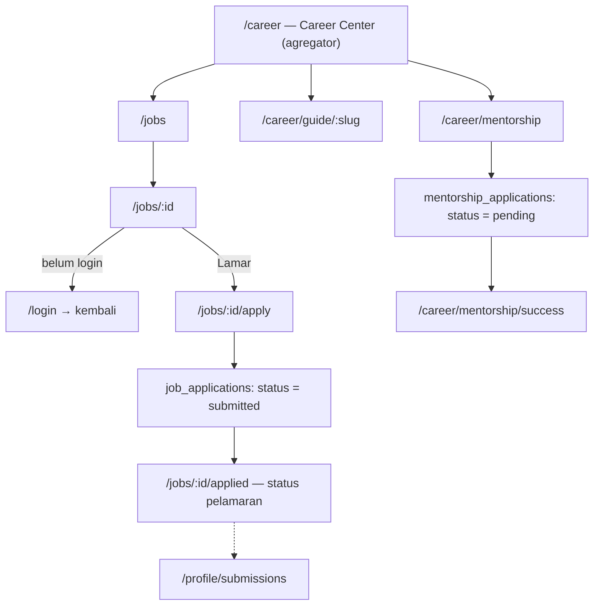

# Career Flow

> Bagian dari [Information Architecture](./Information%20Architecture.md). Audit terhadap kode: **2026-09-09**.

## Alur

## Rute

| Rute | Isi |
|---|---|
| `/jobs` | Listing loker/magang, filter tipe (`internship`/`full_time`/`part_time`/`volunteer`) + lokasi |
| `/jobs/:id` | Detail lowongan + tombol lamar |
| `/jobs/:id/apply` | Form lamaran: resume (URL Drive atau unggah PDF) + cover letter opsional |
| `/jobs/:id/applied` | Status pelamaran user (`submitted` → `under_review` → `interview` → `offered`/`rejected`) |
| `/career` | **Career Center** — halaman agregator: loker terbaru + artikel guide + CTA mentorship, di-query dari 3 tabel |
| `/career/guide/:slug` | Artikel panduan karir (`career_guide_articles`) |
| `/career/mentorship` | Form "Alumni Network Mentorship" — bidang minat, latar belakang, motivasi. Terpisah dari lamaran kerja. |
| `/career/mentorship/success` | Konfirmasi; matching mentor & tindak lanjut lewat email |

## Catatan

- **Career Center bukan entitas** — komposisinya diambil dari `job_postings` + `career_guide_articles` + CTA `mentorship_applications`. Satu route, tiga sumber.
- Belum ada sisi console khusus untuk mentorship — `mentorship_applications` dikelola lewat query langsung / laporan; loker & guide lewat modul konten.

## Terkait

[Entity Relationship Diagram](./Entity%20Relationship%20Diagram.md) § 4
