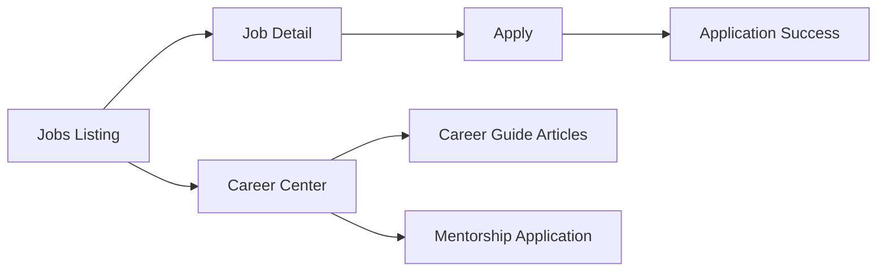

# Career Flow

> Bagian dari [Information Architecture](./Information%20Architecture.md).

## Alur

## Layar

| Layar | File | Catatan |
|---|---|---|
| Jobs (listing) | `jobs_ppit_nanjing`, `jobs_opportunities_refined`, kanonik `jobs_opportunities_expanded` | Loker/magang untuk anggota |
| Job Detail | `job_details_ppit_nanjing` | Contoh: "Software Engineering Intern" |
| Job Application Success | `job_application_success_ppit_nanjing`, kanonik `_final` (batch 2) | |
| Career Center | `career_center_ppit_nanjing`, kanonik `comprehensive_career_center` | Hub — gabungan job listing + guide + mentorship |
| Career Guide | `career_guide_ppit_nanjing` | Artikel panduan karir, contoh: "Mastering the Chinese Tech Interview" |
| Join Mentorship Program | `join_mentorship_program_ppit_nanjing` | "Alumni Network Mentorship Application" — form terpisah dari lamaran kerja |

## Entitas terkait

[JOB_POSTING](./Data%20Dictionary.md), [JOB_APPLICATION](./Data%20Dictionary.md), [CAREER_GUIDE_ARTICLE](./Data%20Dictionary.md), [MENTORSHIP_APPLICATION](./Data%20Dictionary.md)

## Catatan

"Career Center" adalah **halaman agregator**, bukan entitas data tersendiri — komposisinya (job listing terbaru + artikel guide + CTA mentorship) diambil dari 3 tabel berbeda. Build sebagai satu route yang query 3 sumber, bukan CMS page terpisah.
