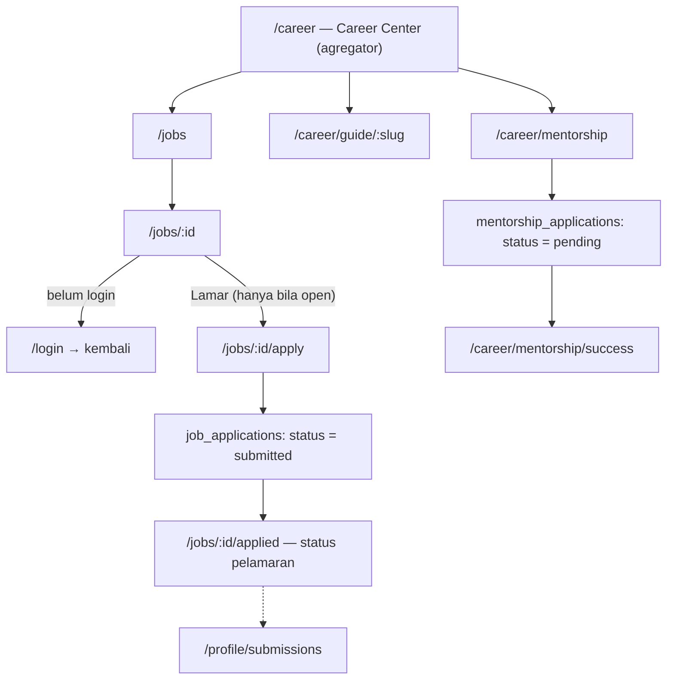
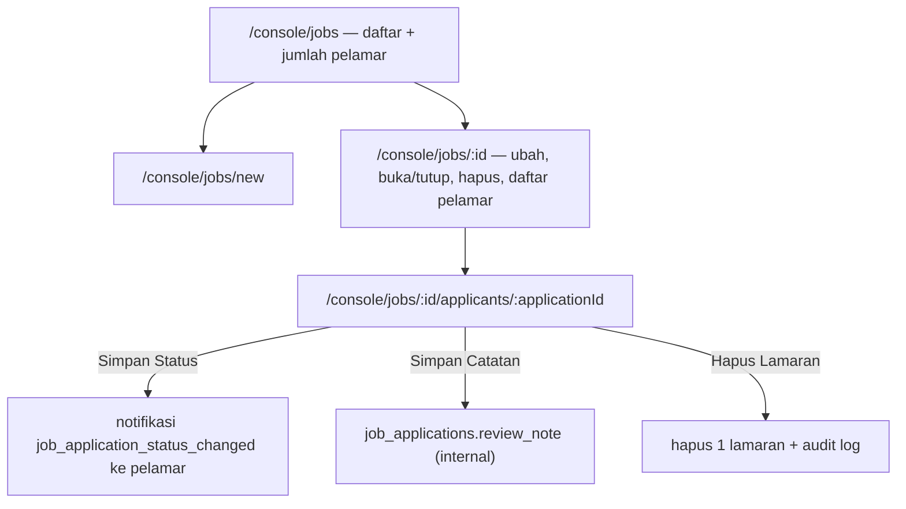

# Career Flow

> Bagian dari [Information Architecture](./Information%20Architecture.md). Audit terhadap kode: **2026-10-01** (sisi console lowongan ditambahkan; sebelumnya 2026-09-09).

Dua sisi: **publik** (mahasiswa melihat dan melamar lowongan) dan **console** (pengurus memasang lowongan dan memproses lamaran). SOP operasional untuk pengurus ada di Help Center, artikel `karier` (lihat [Terkait](#terkait)).

## Alur publik

```mermaid
flowchart TD
    Jobs["/jobs"] --> Detail["/jobs/:id"]
    Detail -->|belum login| Login["/login → kembali"]
    Detail -->|"Lamar (hanya bila open)"| Apply["/jobs/:id/apply"]
    Apply --> Submit["job_applications: status = submitted"]
    Submit --> Applied["/jobs/:id/applied — status pelamaran"]
    Applied -.-> History["/profile/submissions"]

    Career["/career — Career Center (agregator)"] --> Jobs
    Career --> Guide["/career/guide/:slug"]
    Career --> Mentor["/career/mentorship"]
    Mentor --> MentorSubmit["mentorship_applications: status = pending"]
    MentorSubmit --> MentorOk["/career/mentorship/success"]
```

## Alur console (modul `career`)

```mermaid
flowchart TD
    List["/console/jobs — daftar + jumlah pelamar"] --> New["/console/jobs/new"]
    List --> Edit["/console/jobs/:id — ubah, buka/tutup, hapus, daftar pelamar"]
    Edit --> Review["/console/jobs/:id/applicants/:applicationId"]
    Review -->|"Simpan Status"| Notif["notifikasi job_application_status_changed ke pelamar"]
    Review -->|"Simpan Catatan"| Note["job_applications.review_note (internal)"]
    Review -->|"Hapus Lamaran"| Del["hapus 1 lamaran + audit log"]
```

## Rute

| Rute | Isi |
|---|---|
| `/jobs` | Listing loker/magang (hanya `status = open`), filter tipe (`internship`/`full_time`/`part_time`/`volunteer`) + lokasi |
| `/jobs/:id` | Detail lowongan. Tombol lamar hanya muncul bila `open`; bila `closed` tampil keterangan ditutup |
| `/jobs/:id/apply` | Form lamaran: resume (URL Drive atau unggah PDF) + cover letter opsional. **Lowongan yang sudah ditutup dialihkan ke `/jobs/:id`** |
| `/jobs/:id/applied` | Status pelamaran user (`submitted` → `under_review` → `interview` → `offered`/`rejected`) |
| `/career` | **Career Center** — halaman agregator: loker terbaru + artikel guide + CTA mentorship, di-query dari 3 tabel |
| `/career/guide/:slug` | Artikel panduan karir (`career_guide_articles`) |
| `/career/mentorship` | Form "Alumni Network Mentorship" — bidang minat, latar belakang, motivasi. Terpisah dari lamaran kerja. |
| `/career/mentorship/success` | Konfirmasi; matching mentor & tindak lanjut lewat email |
| `/console/jobs` | Daftar semua lowongan (open + closed) dengan jumlah pelamar |
| `/console/jobs/new` | Form lowongan baru. Kotak "Langsung buka" mati = tersimpan `closed` (tidak tampil di daftar, tidak bisa dilamar, tapi halaman `/jobs/:id`-nya tetap terbaca lewat tautan) |
| `/console/jobs/:id` | Ubah lowongan, Tutup/Buka lagi, Hapus, dan daftar pelamar |
| `/console/jobs/:id/applicants/:applicationId` | Tinjau satu pelamar: email, CV, cover letter, ubah status, catatan, riwayat status, hapus lamaran |

## Akses

- Modul `career` di `adminModuleScope` (`src/lib/admin-scope-constants.ts`). Bukan kunci sensitif: admin penuh boleh mencentangnya untuk divisi mana pun lewat `/console/organization`.
- Seed instalasi baru memberikannya ke **Divisi Usaha Dana** (`src/db/seed.ts`). **Database produksi tidak ikut berubah** — centang sekali lewat UI. Lihat [Konfirmasi Akses Admin](./Konfirmasi%20Akses%20Admin.md) untuk kondisi produksi.
- Setiap halaman dan Server Action memanggil `requireModuleAccess("career")` sendiri; layout `/console` saja tidak cukup.

## Keputusan desain

- **Status dan catatan disimpan lewat dua aksi terpisah** (`updateJobApplicationStatus`, `updateJobApplicationNote`). Kalau digabung, menyimpan catatan dari tab lama diam-diam mengembalikan status yang baru diubah pengurus lain. Pola yang sama dipakai modul Pendaftaran.
- **Notifikasi hanya saat status benar-benar berubah**, bisa dimatikan per simpan lewat kotak "Kirim notifikasi ke pelamar" (pola `notifyApplicant` di Pendaftaran, karena notifikasi tidak bisa ditarik), dan dibungkus try/catch sehingga notifikasi yang gagal tidak membatalkan perubahan status. Riwayat mencatat apakah pelamar diberi tahu. Satu template generik `job_application_status_changed` (variabel `jobTitle`, `statusLabel`), bukan satu per status, karena kelimanya langkah satu pipeline. Bisa diedit di `/console/notifications`.
- **"Tutup" ditegakkan di server**, bukan hanya menyembunyikan tombol: `applyToJob` dan halaman apply sama-sama menolak lowongan yang bukan `open`.
- **Label status** (`src/lib/job-application.ts`) memakai kata yang sama dengan kamus i18n `jobs.status.*`. Halaman `/jobs/:id/applied` memetakan enum DB (`under_review`, `offered`) ke kunci kamus lama (`reviewed`, `accepted`) — sebelumnya pemetaan ini tidak cocok dan akan menampilkan teks enum mentah begitu ada yang mengubah status.
- **Hapus lowongan = hapus semua lamarannya** (FK cascade). Untuk permintaan hapus data satu pelamar ada aksi terpisah `deleteJobApplication`. Keduanya menulis `audit_logs` (`job_posting` / `job_application`, action `deleted`; yang pertama mencatat judul, perusahaan, dan jumlah pelamar) dan diperingatkan di dialog konfirmasi.
- **`resumeUrl` divalidasi** sebagai alamat http(s) saat melamar (`isHttpUrl` di `src/lib/job-application.ts`) dan hanya dirender sebagai tautan di console bila lolos cek yang sama, karena nilainya berasal dari input pelamar. Nama berkas untuk teks tautan diturunkan secara defensif (`decodeURIComponent` bisa melempar pada `%` yang menggantung).
- **Semua id dari FormData dan route `[id]`** dicek `UUID_RE` (`src/lib/uuid.ts`) sebelum menyentuh kolom uuid, supaya id ngawur menjadi 404/penolakan, bukan error Postgres.
- **Mutasi lowongan me-revalidate `/jobs`, `/jobs/:id`, `/career`, dan `/sitemap.xml`** (sitemap di-prerender statis dan memuat lowongan `open`).
- **Skema**: hanya satu kolom baru, `job_applications.review_note` (nullable, aditif), migrasi `drizzle/0041_job_application_review_note.sql`. Siapa dan kapan mengubah status sudah ada di `audit_logs` (`entity_type = job_application`).

## Batasan yang diketahui

Sengaja tidak dikerjakan di Fase 1; masing-masing cukup kecil pada skala PPIT sekarang.

- **Tidak ada unique `(job_id, user_id)` di `job_applications`.** `applyToJob` memeriksa dulu lalu insert, jadi klik ganda bersamaan bisa membuat dua baris. Sudah ada sebelum Fase 1. Perbaikan yang benar adalah unique index, tetapi harus mengecek duplikat yang sudah ada di produksi dulu, dan index itu sekaligus mempercepat query per lowongan (kolom FK `job_id` belum di-index).
- **Belum ada pagination** di daftar lowongan dan daftar pelamar. Wajar untuk ratusan baris; tambahkan bila satu lowongan mulai menerima ratusan lamaran.
- **`application_deadline` hanya label.** Lowongan tidak tertutup otomatis saat tanggalnya lewat; pengurus menutup manual. Menegakkannya adalah keputusan produk (zona waktu, tanggal inklusif).
- **Berkas CV tidak ikut terhapus** saat lamaran/lowongan dihapus. CV diunggah ke Vercel Blob publik (folder `resume`, URL tak terduga tapi tanpa auth), dan repo belum punya penghapusan Blob di mana pun. Penghapusan otomatis sengaja tidak ditambahkan di sini karena `resume_url` berasal dari input pelamar (bisa menunjuk berkas lain). Prosedurnya manual, ada di SOP `karier`. Perbaikan yang benar adalah menyimpan pathname Blob hasil unggahan di sisi server, bukan memercayai URL kiriman klien.
- **Lowongan `closed` tetap terbaca lewat tautannya.** `/jobs/:id` hanya menukar tombol lamar dengan keterangan ditutup; isinya tetap tampil. Jangan perlakukan "tertutup" sebagai draf rahasia.
- **Notifikasi hanya in-app.** Tidak ada email ke pelamar saat status berubah (berbeda dengan keputusan Pendaftaran pengurus).
- **CV diteruskan ke perusahaan secara manual** oleh pengurus (lihat SOP). Belum ada akun perusahaan.
- **Artikel panduan karir dan mentorship belum punya sisi console** — `career_guide_articles` dan `mentorship_applications` dikelola lewat query langsung/laporan. (Catatan lama di dokumen ini yang menyebut "loker & guide lewat modul konten" tidak benar.)

## Rencana Fase 2 — akun perusahaan (belum dibangun)

Latar belakang: beberapa perusahaan mulai menghubungi PPIT langsung untuk merekrut lulusan. Keputusan yang sudah disepakati:

- Perusahaan **mendaftar sendiri, admin memverifikasi dulu** (pola sama dengan verifikasi pembayaran: kirim → tinjau → diverifikasi/ditolak + notifikasi).
- Recruiter boleh melihat dan memproses pelamar **lowongan perusahaannya sendiri saja**, tidak pernah lintas perusahaan.
- Dibangun bertahap: console admin dulu (selesai), akun perusahaan setelahnya.

Rancangannya, supaya Divisi Teknologi berikutnya tidak menemukannya ulang:

- **Tidak ada kolom `account_type` di `users`** — itu keputusan sengaja (`src/lib/membership-status.ts`). Perusahaan dimodelkan sebagai *resource*: tabel `companies` + `company_recruiters` (unik `(company_id, user_id)`) yang menautkan `users` biasa, persis pola `event_committee` + `src/lib/event-access.ts`. `src/auth.ts` tidak berubah.
- `job_postings.company_id` **nullable dan aditif**; kolom teks `company` dipertahankan sebagai nama tampil. **Jangan backfill** dari teks lama ke `companies` — itu mengarang identitas yang tidak pernah diverifikasi manusia (filosofi di `schema.ts`, komentar `sensus_profiles`).
- Gate `requireCompletedSensus` **tidak boleh** dipakai untuk pendaftaran perusahaan (itu memeriksa status mahasiswa).
- Lowongan perusahaan yang sudah terverifikasi langsung tayang; admin tetap bisa menutup/menghapus.
- **Peringatan kebocoran data:** `src/app/console/page.tsx` (dashboard `/console`) tidak punya gate modul sendiri dan menampilkan teks masukan, nama peserta, dan pelamar pengurus ke siapa pun yang lolos layout. Sebelum recruiter diizinkan masuk `/console`, dashboard harus mengalihkan mereka ke `/console/jobs`, dan seluruh halaman `/console/**` harus diaudit untuk gate modulnya sendiri. Alternatif yang lebih ketat: area terpisah `/company/*`.

## Terkait

- SOP pengurus: Help Center artikel **`karier`** (`src/db/seed-help-articles.ts`). Diterapkan ke database dengan `npx tsx --env-file=.env src/db/seed-help-articles.ts` (idempotent). Unduh sebagai Word dari `/console/docs` untuk diserahkan ke BPH/pusat.
- [Entity Relationship Diagram](./Entity%20Relationship%20Diagram.md) § 4, [Data Dictionary](./Data%20Dictionary.md) § 5
- [Admin Dashboard](./Admin%20Dashboard.md), [User & Role Management](./User%20&%20Role%20Management.md)
