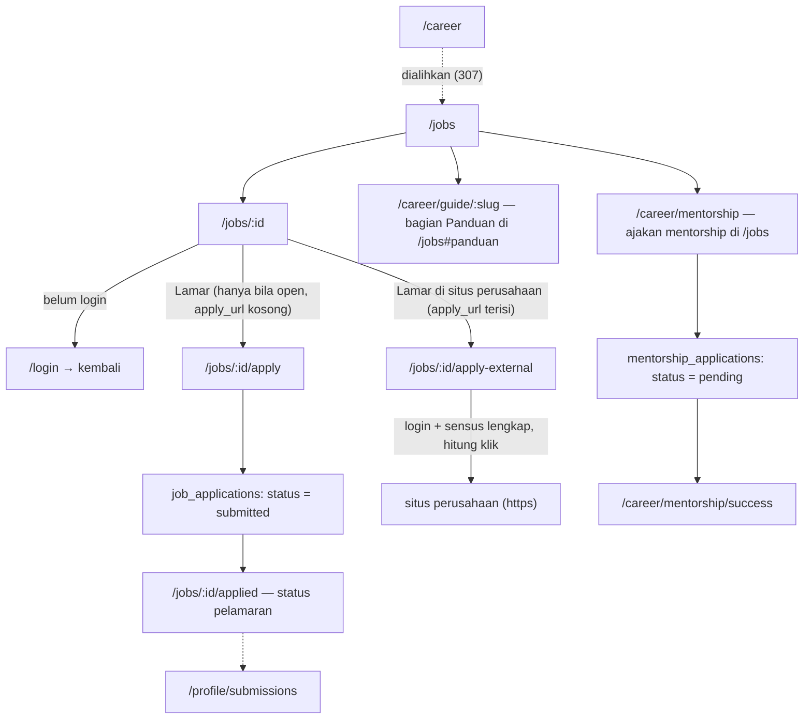
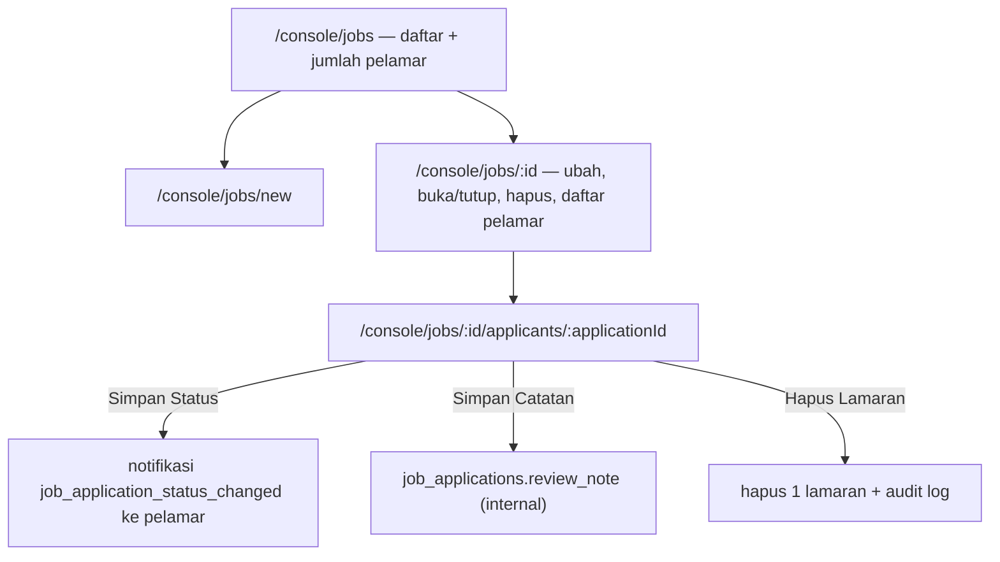

# Career Flow

> Bagian dari [Information Architecture](./Information%20Architecture.md). Audit terhadap kode: **2026-10-01** (sisi console lowongan ditambahkan; sebelumnya 2026-09-09).

Dua sisi: **publik** (mahasiswa melihat dan melamar lowongan) dan **console** (pengurus memasang lowongan dan memproses lamaran). SOP operasional untuk pengurus ada di Help Center, artikel `karier` (lihat [Terkait](#terkait)).

## Alur publik

```mermaid
flowchart TD
    Jobs["/jobs"] --> Detail["/jobs/:id"]
    Detail -->|belum login| Login["/login → kembali"]
    Detail -->|"Lamar (hanya bila open, apply_url kosong)"| Apply["/jobs/:id/apply"]
    Apply --> Submit["job_applications: status = submitted"]
    Submit --> Applied["/jobs/:id/applied — status pelamaran"]
    Applied -.-> History["/profile/submissions"]
    Detail -->|"Lamar di situs perusahaan (apply_url terisi)"| Ext["/jobs/:id/apply-external"]
    Ext -->|"login + sensus lengkap, hitung klik"| Company["situs perusahaan (https)"]

    Jobs --> Guide["/career/guide/:slug — bagian Panduan di /jobs#panduan"]
    Jobs --> Mentor["/career/mentorship — ajakan mentorship di /jobs"]
    OldCareer["/career"] -.->|"dialihkan (307)"| Jobs
    Mentor --> MentorSubmit["mentorship_applications: status = pending"]
    MentorSubmit --> MentorOk["/career/mentorship/success"]
```

## Alur console (modul `career`)

```mermaid
flowchart TD
    List["/console/jobs — daftar + jumlah pelamar"] --> New["/console/jobs/new"]
    List --> Edit["/console/jobs/:id — ubah, buka/tutup, hapus, daftar pelamar"]
    Edit --> Review["/console/jobs/:id/applicants/:applicationId"]
    Review -->|"Simpan Status"| Notif["notifikasi job_application_status_changed ke pelamar"]
    Review -->|"Simpan Catatan"| Note["job_applications.review_note (internal)"]
    Review -->|"Hapus Lamaran"| Del["hapus 1 lamaran + audit log"]
```

## Rute

| Rute | Isi |
|---|---|
| `/jobs` | Halaman publik tunggal untuk karir ("Career Opportunities in Nanjing"): listing loker/magang **aktif** (hanya `status = open` dan belum lewat batas lamaran), filter tipe (`internship`/`full_time`/`part_time`/`volunteer`) + lokasi. Lowongan yang **lewat batas** tetap tampil **abu-abu tanpa tombol lamar**, dibatasi `EXPIRED_VISIBLE_LIMIT` (3) yang paling baru; tautan ke `/jobs/archive` muncul bila ada isi arsip. Lalu bagian **Panduan** (`#panduan`, sampai 4 artikel terbaru) dan ajakan mentorship |
| `/jobs/:id` | Detail lowongan. Tombol lamar hanya muncul bila `open` **dan belum lewat batas**; lewat batas → keterangan `jobs.expiredNote` + badge "Lewat batas"; `closed` → keterangan ditutup |
| `/jobs/:id/apply` | Form lamaran: resume (URL Drive atau unggah PDF) + cover letter opsional. **Lowongan yang sudah ditutup, lewat batas lamaran, atau yang `apply_url`-nya terisi, dialihkan ke `/jobs/:id`** |
| `/jobs/:id/apply-external` | Route handler (GET) untuk lowongan yang melamar di situs perusahaan. Wajib login + sensus lengkap, menambah `external_clicks`, lalu mengalihkan ke `apply_url`. Lowongan lewat batas lamaran juga ditolak di sini. Tujuan dibaca dari database, bukan dari request |
| `/jobs/archive` | Arsip lowongan publik: semua yang `closed` atau lewat batas lamaran, abu-abu, tanpa tombol lamar (hanya bisa dibaca) |
| `/jobs/:id/applied` | Status pelamaran user (`submitted` → `under_review` → `interview` → `offered`/`rejected`) |
| `/career` | **Dialihkan ke `/jobs`** (307). Dulu "Career Center" (6 lowongan terbaru + 4 panduan + ajakan mentorship), yang seluruh isinya sudah ada di `/jobs`. Lihat Keputusan desain |
| `/career/guide/:slug` | Artikel panduan karir (`career_guide_articles`) |
| `/career/mentorship` | Form "Alumni Network Mentorship" — bidang minat, latar belakang, motivasi. Terpisah dari lamaran kerja. |
| `/career/mentorship/success` | Konfirmasi; matching mentor & tindak lanjut lewat email |
| `/console/jobs` | Daftar semua lowongan (open + closed) dengan thumbnail poster, jumlah pelamar, dan penanda "Lewat batas" bila `applicationDeadline` sudah lewat |
| `/console/jobs/new` | Form lowongan baru, termasuk "Cara melamar" (form PPIT atau tautan situs perusahaan) dan unggah **poster** opsional. Kotak "Langsung buka" mati = tersimpan `closed` (tidak tampil di daftar, tidak bisa dilamar, tapi halaman `/jobs/:id`-nya tetap terbaca lewat tautan) |
| `/console/jobs/:id` | Ubah lowongan (termasuk poster), Tutup/Buka lagi, Hapus, dan daftar pelamar |
| `/console/jobs/:id/applicants/:applicationId` | Tinjau satu pelamar: email, CV, cover letter, ubah status, catatan, riwayat status, hapus lamaran |

## Akses

- Modul `career` di `adminModuleScope` (`src/lib/admin-scope-constants.ts`). Bukan kunci sensitif: admin penuh boleh mencentangnya untuk divisi mana pun lewat `/console/organization`.
- Seed instalasi baru memberikannya ke **Divisi Usaha Dana** (`src/db/seed.ts`). **Database produksi tidak ikut berubah** — centang sekali lewat UI. Lihat [Konfirmasi Akses Admin](./Konfirmasi%20Akses%20Admin.md) untuk kondisi produksi.
- Setiap halaman dan Server Action memanggil `requireModuleAccess("career")` sendiri; layout `/console` saja tidak cukup.

## Keputusan desain

- **Status dan catatan disimpan lewat dua aksi terpisah** (`updateJobApplicationStatus`, `updateJobApplicationNote`). Kalau digabung, menyimpan catatan dari tab lama diam-diam mengembalikan status yang baru diubah pengurus lain. Pola yang sama dipakai modul Pendaftaran.
- **Notifikasi hanya saat status benar-benar berubah**, bisa dimatikan per simpan lewat kotak "Kirim notifikasi ke pelamar" (pola `notifyApplicant` di Pendaftaran, karena notifikasi tidak bisa ditarik), dan dibungkus try/catch sehingga notifikasi yang gagal tidak membatalkan perubahan status. Riwayat mencatat apakah pelamar diberi tahu. Satu template generik `job_application_status_changed` (variabel `jobTitle`, `statusLabel`), bukan satu per status, karena kelimanya langkah satu pipeline. Bisa diedit di `/console/notifications`.
- **"Tutup" ditegakkan di server**, bukan hanya menyembunyikan tombol: `applyToJob` dan halaman apply sama-sama menolak lowongan yang bukan `open`.
- **Label status** (`src/lib/job-application.ts`) memakai kata yang sama dengan kamus i18n `jobs.status.*`. Halaman `/jobs/:id/applied` memetakan enum DB (`under_review`, `offered`) ke kunci kamus lama (`reviewed`, `accepted`) — sebelumnya pemetaan ini tidak cocok dan akan menampilkan teks enum mentah begitu ada yang mengubah status.
- **Hapus lowongan = hapus semua lamarannya** (FK cascade). Untuk permintaan hapus data satu pelamar ada aksi terpisah `deleteJobApplication`. Keduanya menulis `audit_logs` (`job_posting` / `job_application`, action `deleted`; yang pertama mencatat judul, perusahaan, dan jumlah pelamar) dan diperingatkan di dialog konfirmasi.
- **`resumeUrl` divalidasi** sebagai alamat http(s) saat melamar (`isHttpUrl` di `src/lib/job-application.ts`) dan hanya dirender sebagai tautan di console bila lolos cek yang sama, karena nilainya berasal dari input pelamar. Nama berkas untuk teks tautan diturunkan secara defensif (`decodeURIComponent` bisa melempar pada `%` yang menggantung).
- **Semua id dari FormData dan route `[id]`** dicek `UUID_RE` (`src/lib/uuid.ts`) sebelum menyentuh kolom uuid, supaya id ngawur menjadi 404/penolakan, bukan error Postgres.
- **Mutasi lowongan me-revalidate `/jobs`, `/jobs/:id`, dan `/sitemap.xml`** (sitemap di-prerender statis dan memuat lowongan `open`).
- **`/career` digabung ke `/jobs`.** Dua halaman publik yang tumpang tindih membingungkan pengurus dan pengunjung ("beda Career dan Jobs apa?"): `/career` hanya versi lebih sempit dari `/jobs` (6 lowongan, 4 panduan, ajakan mentorship), dan tidak ada di navigasi utama. Sekarang `/career` dialihkan lewat `redirects()` di `next.config.ts` (HTTP 307, bukan 308 supaya mudah dibalik; `redirect()` di dalam halaman hanya menghasilkan 200 + tag meta karena halamannya sudah mulai di-stream) ke `/jobs`, bagian Panduan di `/jobs` menampilkan sampai 4 artikel terbaru, dan `/career` dikeluarkan dari sitemap. Sub-rute `/career/guide/:slug` dan `/career/mentorship*` tetap di URL lama (halaman isi yang berbeda; tautan lama tidak putus); tautan "kembali" di sana kini menuju `/jobs`. `loading.tsx` bergambar Career Center di folder itu dihapus (ia akan tampil sebagai skeleton yang salah untuk artikel dan form mentorship), 14 kunci kamus yang hanya dipakai halaman lama dibuang di kedua bahasa, dan kartu panduan di `/jobs` kini memuat kutipan isi seperti di halaman lama. Panduan diurutkan `published_at desc nulls last` (kolomnya boleh NULL, dan Postgres menaruh NULL di depan untuk DESC). Penamaan di console diseragamkan dengan halaman publiknya: menu yang tadinya "Karier" kini **"Lowongan"** (sidebar, judul halaman, label izin di Organisasi, grup template notifikasi, dan SOP). Yang sengaja **tidak** berubah adalah pengenal teknisnya: kunci modul/izin `career` (jadi izin yang sudah dicentang tetap berlaku), slug artikel Help Center `karier` (dipakai `getGuide("karier")` dan tombol Panduan), dan URL `/console/jobs`. Jangan menamai ulang kunci-kunci itu tanpa migrasi data `adminModuleScope`.
- **Skema**: `job_applications.review_note` (nullable, aditif), migrasi `drizzle/0041_job_application_review_note.sql`. Siapa dan kapan mengubah status sudah ada di `audit_logs` (`entity_type = job_application`).
- **Poster lowongan** (`job_postings.image_url`, migrasi `0043`): opsional, diunggah lewat form console ke Blob folder `jobs` apa adanya (tanpa crop — poster potret paling pas), lalu tampil di kartu sidebar `/jobs/:id` dengan `object-contain` dan sebagai thumbnail di daftar `/jobs`, `/jobs/archive`, serta daftar console. URL yang ditempel di Deskripsi/Persyaratan otomatis menjadi tautan klik (`src/lib/linkified-text.tsx`) — isinya teks biasa dari console, dan banyak pengurus menempel tautan lamaran langsung di sana.
- **Batas lamaran ditegakkan** (`isJobExpired` di `src/lib/job-application.ts`): deadline inklusif (tanggal terakhir masih bisa melamar), dibandingkan sebagai tanggal `YYYY-MM-DD` agar bebas zona waktu. Lewat batas → tidak bisa dilamar di semua pintu (detail, `/apply`, `/apply-external`, `applyToJob`), tampil abu-abu di `/jobs` sampai `EXPIRED_VISIBLE_LIMIT = 3` yang paling baru, dan sisanya (bersama lowongan `closed`) hanya di `/jobs/archive`. Sitemap tidak lagi memuat lowongan lewat batas.
- **Cara melamar: form PPIT atau situs perusahaan** (`job_postings.apply_url`, migrasi `0042`). `NULL` = form PPIT seperti biasa; terisi = lamaran dikerjakan di situs perusahaan dan form PPIT dimatikan (halaman apply dan `applyToJob` sama-sama menolak). Untuk pilihan kedua PPIT tidak menerima data pelamar sama sekali, jadi tidak ada daftar pelamar, status, notifikasi, atau analitik jawaban; satu-satunya ukuran adalah `external_clicks`.
- **Keamanan tautan eksternal.** Tautan hanya `https`, tanpa kredensial tertanam, maksimal 2048 karakter, dan tidak boleh mengarah ke host PPIT sendiri. "Host PPIT" dihitung dari host request, `VERCEL_PROJECT_PRODUCTION_URL`, dan `VERCEL_URL` (bukan daftar yang dikonfigurasi, jadi tetap benar setelah domain pindah), untuk mencegah pengalihan berputar antar alias. Yang disimpan adalah bentuk ternormalisasi (`new URL(raw).href`), karena itu yang benar-benar sudah divalidasi. Rute `apply-external` tidak pernah membaca tujuan dari parameter request, jadi bukan open redirect. Tombolnya `<a>` biasa dengan `rel="nofollow"`, bukan `<Link>`, dan rute mengabaikan permintaan `Sec-Purpose: prefetch/prerender`, supaya pemuatan spekulatif browser tidak mengisi penghitung.
- **Form lowongan mengembalikan isiannya saat validasi gagal.** React 19 mereset kolom form begitu aksi selesai, juga saat aksi mengembalikan `{ error }`. Server (`upsertJobPosting`) karena itu mengembalikan isian yang dikirim di `state.values` beserta `nonce` baru; form dibuat ulang lewat `key={nonce}` sehingga setiap kolom mulai dari yang tadi diketik. Remount dipilih, bukan sekadar `defaultValue`, karena `<select>` tidak mengikuti perubahan `defaultValue` setelah mount (tidak ada padanan DOM-nya). Radio "Cara melamar" uncontrolled.
- **Insiden yang memicunya.** Di versi pertama (radio controlled), mengirim tautan `http://` ditolak dengan benar, tetapi pengiriman https berikutnya tersimpan tanpa error sebagai "Lewat form PPIT" dan tautannya hilang. Dugaan paling kuat: reset membuat radio tak terpilih di DOM sehingga `applyMode` tidak ikut terkirim. Mekanisme itu belum diamati langsung; yang terbukti hanya pola gejalanya (pengiriman bersih menyimpan tautan, pengiriman setelah error tidak). Sebagai pengaman terpisah, server kini menolak tautan terisi bila `applyMode` bukan `external`, supaya kegagalan semacam ini keras, bukan diam-diam.
- **Masalah reset yang sama masih ada di form console lain** (`NewsArticleForm` dan lainnya) yang memakai `useActionState` + `{ error }`. Perbaikan yang lebih umum adalah satu komponen form bersama yang mengirim lewat `onSubmit` + `startTransition(() => formAction(new FormData(form)))`, yang tidak memicu reset otomatis; belum dikerjakan.
- **Perubahan `apply_url` dicatat di `audit_logs`** (`job_posting`, action `apply_url_changed`, nilai sebelum dan sesudah), karena tombol berlogo PPIT mengirim anggota ke sana. Edit lowongan lainnya belum diaudit.
- **Syarat masuk `apply-external` sama dengan melamar lewat PPIT** (login + sensus lengkap): lowongan di halaman ini untuk anggota, dan itu sekaligus menjaga `external_clicks` dari robot dan pengunjung anonim. Ini keputusan produk yang mudah dibalik bila tautan perlu terbuka untuk umum.

## Batasan yang diketahui

Sengaja tidak dikerjakan di Fase 1; masing-masing cukup kecil pada skala PPIT sekarang.

- **Tidak ada unique `(job_id, user_id)` di `job_applications`.** `applyToJob` memeriksa dulu lalu insert, jadi klik ganda bersamaan bisa membuat dua baris. Sudah ada sebelum Fase 1. Perbaikan yang benar adalah unique index, tetapi harus mengecek duplikat yang sudah ada di produksi dulu, dan index itu sekaligus mempercepat query per lowongan (kolom FK `job_id` belum di-index).
- **Belum ada pagination** di daftar lowongan dan daftar pelamar. Wajar untuk ratusan baris; tambahkan bila satu lowongan mulai menerima ratusan lamaran.
- **`application_deadline` kini ditegakkan**, bukan lagi sekadar label: lewat batas = tidak bisa dilamar dan tampil abu-abu (lihat Keputusan desain). Yang TETAP manual adalah penutupan permanen lewat tombol Tutup — sengaja, supaya pengurus bisa menghentikan lowongan lebih awal tanpa mengubah tanggal.
- **Berkas CV tidak ikut terhapus** saat lamaran/lowongan dihapus. CV diunggah ke Vercel Blob publik (folder `resume`, URL tak terduga tapi tanpa auth), dan repo belum punya penghapusan Blob di mana pun. Penghapusan otomatis sengaja tidak ditambahkan di sini karena `resume_url` berasal dari input pelamar (bisa menunjuk berkas lain). Prosedurnya manual, ada di SOP `karier`. Perbaikan yang benar adalah menyimpan pathname Blob hasil unggahan di sisi server, bukan memercayai URL kiriman klien.
- **Lowongan `closed` tetap terbaca lewat tautannya.** `/jobs/:id` hanya menukar tombol lamar dengan keterangan ditutup; isinya tetap tampil. Jangan perlakukan "tertutup" sebagai draf rahasia.
- **Gerbang login + sensus ditulis ulang di `apply-external`** karena `requireCompletedSensus` (`src/lib/sensus-gate.ts`) membuang `returnTo` pada redirect ke `/login`; halaman apply punya penyiasatan yang sama. Memperbaiki helper itu mengubah alur peminjaman dan pendaftaran acara juga, jadi dibiarkan sebagai tindak lanjut tersendiri.
- **Klik dihitung lewat GET.** Pemuatan spekulatif browser sudah diabaikan, tetapi navigasi top-level lintas situs oleh anggota yang login masih bisa menambah hitungan. Karena angkanya hanya indikasi, ini diterima; pencatatan yang kebal akan memakai POST (Server Action lalu redirect).
- **`external_clicks` bukan jumlah pelamar.** Satu orang yang klik berkali-kali dihitung berkali-kali, dan klik tidak berarti orang itu benar-benar menyelesaikan lamaran di situs perusahaan. Kalau perlu hitungan per orang, tabel klik per anggota harus ditambah.
- **Situs perusahaan bisa tidak terbuka dari Tiongkok** (mis. layanan Google). PPIT tidak bisa memeriksanya otomatis; SOP meminta pengurus mencoba tautannya sebelum membuka lowongan.
- **Notifikasi hanya in-app.** Tidak ada email ke pelamar saat status berubah (berbeda dengan keputusan Pendaftaran pengurus).
- **CV diteruskan ke perusahaan secara manual** oleh pengurus (lihat SOP). Belum ada akun perusahaan.
- **Artikel panduan karir dan mentorship belum punya sisi console** — `career_guide_articles` dan `mentorship_applications` dikelola lewat query langsung/laporan. (Catatan lama di dokumen ini yang menyebut "loker & guide lewat modul konten" tidak benar.)

## Rencana Fase 2 — akun perusahaan (belum dibangun)

Latar belakang: beberapa perusahaan mulai menghubungi PPIT langsung untuk merekrut lulusan. Keputusan yang sudah disepakati:

- Perusahaan **mendaftar sendiri, admin memverifikasi dulu** (pola sama dengan verifikasi pembayaran: kirim → tinjau → diverifikasi/ditolak + notifikasi).
- Recruiter boleh melihat dan memproses pelamar **lowongan perusahaannya sendiri saja**, tidak pernah lintas perusahaan.
- Dibangun bertahap: console admin dulu (selesai), akun perusahaan setelahnya.

Rancangannya, supaya Divisi Teknologi berikutnya tidak menemukannya ulang:

- **Tidak ada kolom `account_type` di `users`** — itu keputusan sengaja (`src/lib/membership-status.ts`). Perusahaan dimodelkan sebagai *resource*: tabel `companies` + `company_recruiters` (unik `(company_id, user_id)`) yang menautkan `users` biasa, persis pola `event_committee` + `src/lib/event-access.ts`. `src/auth.ts` tidak berubah.
- `job_postings.company_id` **nullable dan aditif**; kolom teks `company` dipertahankan sebagai nama tampil. **Jangan backfill** dari teks lama ke `companies` — itu mengarang identitas yang tidak pernah diverifikasi manusia (filosofi di `schema.ts`, komentar `sensus_profiles`).
- Gate `requireCompletedSensus` **tidak boleh** dipakai untuk pendaftaran perusahaan (itu memeriksa status mahasiswa).
- Lowongan perusahaan yang sudah terverifikasi langsung tayang; admin tetap bisa menutup/menghapus.
- **Peringatan kebocoran data:** `src/app/console/page.tsx` (dashboard `/console`) tidak punya gate modul sendiri dan menampilkan teks masukan, nama peserta, dan pelamar pengurus ke siapa pun yang lolos layout. Sebelum recruiter diizinkan masuk `/console`, dashboard harus mengalihkan mereka ke `/console/jobs`, dan seluruh halaman `/console/**` harus diaudit untuk gate modulnya sendiri. Alternatif yang lebih ketat: area terpisah `/company/*`.

### Kebutuhan tambahan untuk sisi perusahaan (2026-10-01, belum dirancang)

Permintaan dari pengurus: portal perusahaan sebaiknya setara **JobStreet**, dengan fitur yang benar-benar dibutuhkan recruiter, bukan sekadar formulir posting.

- **Pertanyaan penyaring per lowongan.** Perusahaan membuat sendiri pertanyaan yang harus dijawab pelamar saat melamar (teks, pilihan, ya/tidak, skala, dst), wajib atau opsional. Jawaban tersimpan per lamaran.
- **Recruiter melihat CV dan jawaban** pelamar lowongan perusahaannya sendiri, dan menggeser status (pipeline yang sama dengan Fase 1).
- **Tab Analitik per lowongan**: ringkasan jawaban per pertanyaan (distribusi, grafik) dengan **filter** (mis. status lamaran, jawaban tertentu, kampus/kota), mirip tab Analitik sensus (`/console/sensus`).
- **Perwakilan perusahaan mengelola pertanyaannya sendiri (CRUD).** Aturan yang disarankan agar analitik tidak rusak: bebas ubah selama belum ada pelamar; setelah ada pelamar hanya boleh menambah pertanyaan opsional, memperbaiki salah ketik di teks, dan mengarsipkan (jawaban lama tetap tersimpan). Tipe dan pilihan jawaban tidak boleh berubah, dan tidak ada hapus permanen.
- **Opsi lamaran lewat tautan perusahaan** sudah dibangun (lihat Keputusan desain, `apply_url`). Lowongan seperti itu tidak punya pelamar, pertanyaan, atau analitik jawaban di PPIT.
- **Prasyarat sebelum recruiter melihat CV:** CV kini disimpan di Blob publik (folder `resume`). Pindahkan ke penyimpanan privat dengan proxy berotorisasi, seperti folder `sensus`, karena tautan publik bisa dibagikan dan tidak bisa dicabut.

Bahan yang sudah ada dan patut dipakai ulang, supaya tidak membangun mesin formulir kedua:

- `src/lib/membership-form.ts` — definisi tipe field (`MembershipFieldType`, `FIELD_TYPE_LABELS`, `OPTION_TYPES`, `SCALE_TYPES`, grid), `QUESTION_BANK`, dan penilaian jawaban. Mesin pertanyaan Pendaftaran sudah mendukung banyak tipe.
- `src/components/console/sensus-analytics-view.tsx` — tampilan analitik (donat + batang, tanpa dependency baru) yang bisa dijadikan dasar tab Analitik lowongan.

Hal yang harus diputuskan saat dirancang: apakah pertanyaan penyaring boleh memakai aturan gugur otomatis (knockout), apakah jawaban pelamar boleh dilihat perusahaan sebelum pelamar diberi tahu, dan bagaimana persetujuan pelamar atas dibagikannya CV dan jawaban ke perusahaan (lihat catatan privasi di atas). Skema jawaban per lamaran hampir pasti butuh tabel baru; ini **bukan** tambahan kecil di atas Fase 1.

## Terkait

- SOP pengurus: Help Center artikel **`karier`** (`src/db/seed-help-articles.ts`). Diterapkan ke database dengan `npx tsx --env-file=.env src/db/seed-help-articles.ts` (idempotent). Unduh sebagai Word dari `/console/docs` untuk diserahkan ke BPH/pusat.
- [Entity Relationship Diagram](./Entity%20Relationship%20Diagram.md) § 4, [Data Dictionary](./Data%20Dictionary.md) § 5
- [Admin Dashboard](./Admin%20Dashboard.md), [User & Role Management](./User%20&%20Role%20Management.md)
