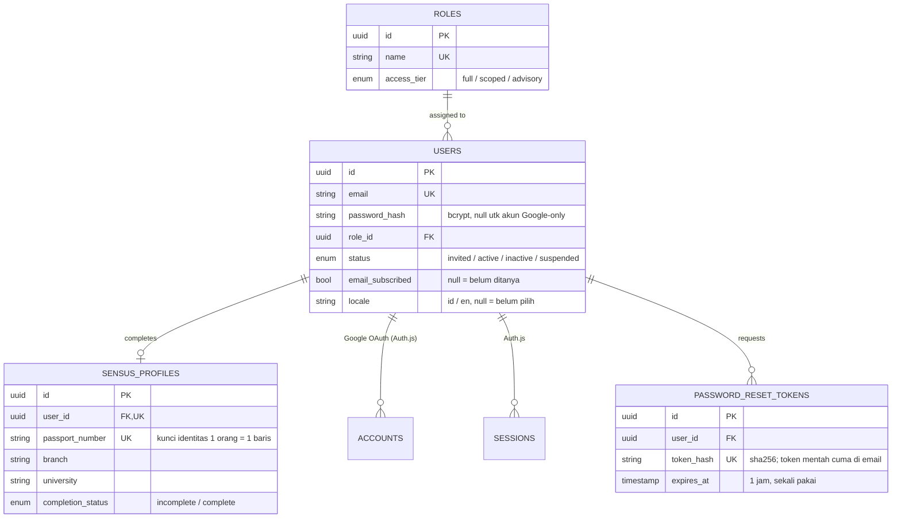
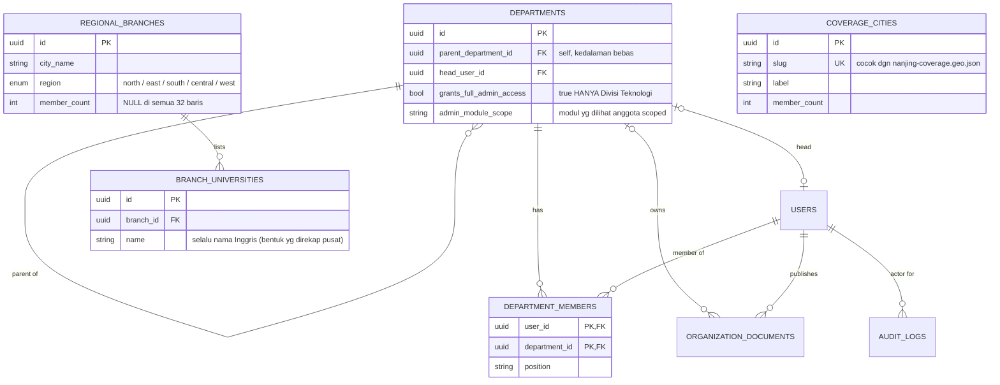
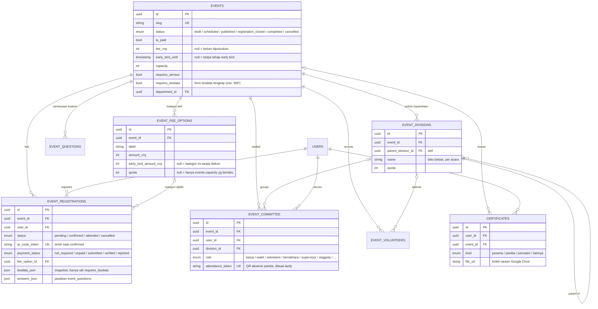
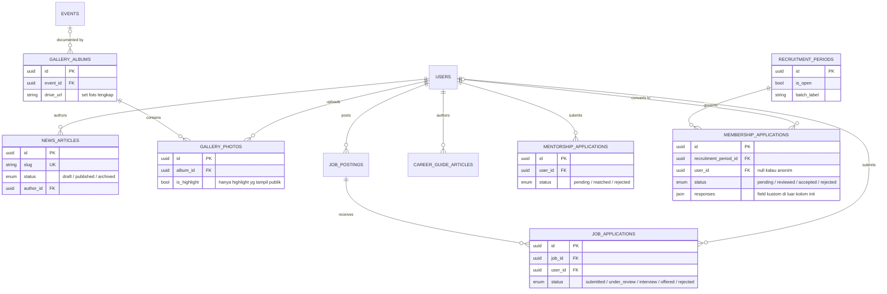
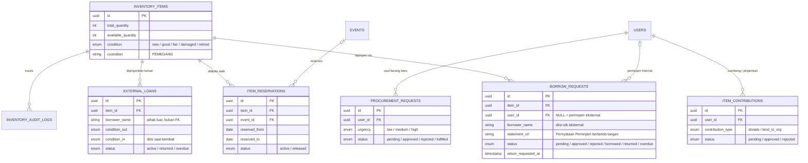

# Entity Relationship Diagram — PPIT Nanjing

> Bagian dari [PPIT Nanjing MOC](./README.md). Kolom lengkap tiap entitas ada di [Data Dictionary](./Data%20Dictionary.md). **Sumber kebenaran = `src/db/schema.ts`** (58 tabel). Diagram dipecah per domain karena satu ERD utuh sudah tidak terbaca.

Audit terakhir terhadap `schema.ts`: **2026-09-09.**

## Peta domain

| # | Domain | Entitas inti | Layar / flow |
|---|---|---|---|
| 1 | **Identitas & Akses** | `users`, `roles`, `sensus_profiles`, `accounts`, `sessions`, `password_reset_tokens` | [Homepage & Login](./Homepage%20&%20Login.md), [Sensus Profile Flow](./Sensus%20Profile%20Flow.md), [User & Role Management](./User%20&%20Role%20Management.md) |
| 2 | **Organisasi** | `departments`, `department_members`, `audit_logs`, `organization_documents`, `regional_branches`, `branch_universities`, `coverage_cities` | [Organization Management](./Organization%20Management.md), [Organization & Regional Branches](./Organization%20&%20Regional%20Branches.md) |
| 3 | **Events** | `events`, `event_registrations`, `event_fee_options`, `event_questions`, `event_divisions`, `event_committee`, `event_volunteers`, `certificates` | [Event Flow](./Event%20Flow.md), [Event Management](./Event%20Management.md) |
| 4 | **Konten, Karir & Keanggotaan** | `news_articles`, `gallery_albums`, `gallery_photos`, `job_postings`, `job_applications`, `career_guide_articles`, `mentorship_applications`, `recruitment_periods`, `membership_applications`, `membership_form_fields`, `membership_form_meta` | [Content Pages](./Content%20Pages.md), [Career Flow](./Career%20Flow.md), [Join Us Flow](./Join%20Us%20Flow.md) |
| 5 | **Inventaris & Peminjaman** | `inventory_items`, `borrow_requests`, `item_reservations`, `item_contributions`, `procurement_requests`, `external_loans`, `inventory_audit_logs` | [Equipment Lending Flow](./Equipment%20Lending%20Flow.md), [Inventory Management](./Inventory%20Management.md) |
| 6 | **Platform, Katalog & Konten Kota** | `notifications`, `notification_templates`, `reports`, `help_articles`, `release_notes`, `feedback`, `short_links`, `management_periods`, `drive_folders`, `merchandise`, `sponsors`, `donations`, `donation_channels`, `places`, `universities`, `districts` | [Reports & Analytics](./Reports%20&%20Analytics.md), [Documentation & Help Center](./Documentation%20&%20Help%20Center.md), Catalogue |

⚠️ **Tabel mati:** `permissions` + `role_permissions` ada di schema tapi **tidak pernah di-query**. Otorisasi admin memakai `roles.access_tier` + `departments.grants_full_admin_access` + `departments.admin_module_scope`. Jangan bangun fitur baru di atasnya tanpa memutuskan ulang. `verification_tokens` = milik adapter Auth.js, bukan aplikasi.

---

## 1. Identitas & Akses

- `USERS` **adalah** tabel `users` Auth.js sekaligus (adapter Drizzle). `accounts` / `sessions` / `verification_tokens` dipakai adapter; `password_reset_tokens` tabel terpisah buatan aplikasi untuk alur "lupa password" email/password.
- `SENSUS_PROFILES` di-UNIQUE lewat `passport_number`, bukan cuma `user_id` — satu orang bisa punya dua akun Google dan mengisi sensus dua kali.

## 2. Organisasi

- `REGIONAL_BRANCHES` (32 cabang PPI se-Tiongkok) **tidak** FK ke `departments` (struktur kabinet Nanjing sendiri) — skop beda. `BRANCH_UNIVERSITIES` (±349 kampus) mengisi dropdown bertingkat Cabang→Universitas di form sensus.
- `COVERAGE_CITIES` (9 kota naungan PPIT Nanjing) berdiri sendiri, tanpa FK — batas wilayahnya statis di `src/data/nanjing-coverage.geo.json`.

## 3. Events

- **`EVENT_COMMITTEE` terpisah dari `DEPARTMENT_MEMBER`**: kepanitiaan per-acara, bukan per-kabinet (bendahara acara ≠ bendahara kabinet). `EVENT_DIVISIONS` bernama teks bebas — tiap acara punya susunan sendiri.
- **Tarif dibaca live, tidak di-snapshot.** Tier early-bird diturunkan dari `event_registrations.registered_at` vs `events.early_bird_until` — memundurkan tanggal ikut menggeser harga pendaftar lama (sengaja).
- `EVENT_VOLUNTEERS` = lamaran dari orang yang **belum tentu punya akun**; saat diterima, dibuatkan akun undangan lalu ditugaskan ke `EVENT_COMMITTEE`.
- `GALLERY_ALBUMS` dan `ITEM_RESERVATIONS` juga menunjuk ke `events` — lihat domain 4 & 5.

## 4. Konten, Karir & Keanggotaan

- Form Join Us bisa dikonfigurasi admin lewat `membership_form_fields` (per-field) + `membership_form_meta` (setelan satu-baris: judul, kuis mode, shuffle, dll) — keduanya **tidak** FK-linked, dibaca sebagai config.
- `CAREER_GUIDE_ARTICLES` strukturnya sama dengan `news_articles` minus enum status.

## 5. Inventaris & Peminjaman

- Empat pintu masuk barang: **pinjam** (`borrow_requests`, internal login atau eksternal tanpa akun), **sumbang/pinjamkan ke PPIT** (`item_contributions`, jadi milik PPIT hanya setelah admin approve → `inventory_items`), **usul pengadaan** (`procurement_requests`), **PPIT pinjamkan asetnya keluar** (`external_loans`, aksi admin).
- `ITEM_RESERVATIONS` memblokir seluruh aset di rentang tanggal karena akan dipakai acara.

## 6. Platform, Katalog & Konten Kota

```mermaid
erDiagram
    USERS ||--o{ NOTIFICATIONS : receives
    NOTIFICATION_TEMPLATES |o--o{ NOTIFICATIONS : "rendered from"
    USERS ||--o{ REPORTS : generates
    USERS ||--o{ HELP_ARTICLES : authors
    USERS ||--o{ RELEASE_NOTES : publishes
    USERS |o--o{ FEEDBACK : submits
    USERS |o--o{ DONATIONS : reports
    MANAGEMENT_PERIODS ||--o{ SHORT_LINKS : groups
    MANAGEMENT_PERIODS ||--o{ DRIVE_FOLDERS : scopes
    DEPARTMENTS |o--o{ DRIVE_FOLDERS : "owns folder"

    NOTIFICATIONS {
        uuid id PK
        uuid user_id FK
        uuid template_id FK "null = teks langsung"
        bool is_read
        string related_entity_type
    }
    REPORTS {
        uuid id PK
        enum type "event_attendance / inventory_audit / sensus_summary / student_export / custom"
        json parameters_json
        string file_url
    }
    FEEDBACK {
        uuid id PK
        enum category "bug / design / feature / general"
        enum status "new / in_review / resolved"
        uuid user_id FK "null = belum login"
        string page_path
        json element_rect "element picker"
    }
    SHORT_LINKS {
        uuid id PK
        string slug UK
        string target_url
        uuid management_period_id FK
        int click_count
    }
    DRIVE_FOLDERS {
        uuid id PK
        uuid management_period_id FK
        uuid department_id FK "null = folder tingkat periode"
        string drive_folder_id
    }
    DONATIONS {
        uuid id PK
        uuid user_id FK
        enum status "pending / verified / rejected"
        string proof_url "diverifikasi admin manual"
    }
```

- **Tabel referensi tanpa FK** (dikelola admin, tidak saling terkait): `merchandise`, `sponsors`, `donation_channels`, `places`, `universities`, `districts`. Kolom `*_en` di beberapa di antaranya diisi otomatis oleh Groq (`translateFields()` di `lib/groq.ts`).
- `REPORTS` generik: 4 jenis laporan (`event_attendance`, `inventory_audit`, `sensus_summary`, `student_export`) dibedakan lewat `type` + `parameters_json`, bukan 4 tabel.
- `AUDIT_LOGS` (jejak perubahan data, otomatis) ≠ `RELEASE_NOTES` (catatan rilis fitur, ditulis manual).

---

## Keputusan Desain Data

- **`USERS` = tabel `users` Auth.js.** Password bcrypt, session JWT, OAuth Google ditangani Auth.js v5. Lihat [Tech Stack](./Tech%20Stack.md).
- **Tanpa tabel `MEDIA` polymorphic.** URL gambar/berkas disimpan langsung sebagai kolom string (`image_url`, `cover_image_url`, `file_url`) di tabel pemilik, menunjuk ke Vercel Blob. Pilihan sadar untuk kesederhanaan.
- **`EVENT_COMMITTEE` terpisah dari `DEPARTMENT_MEMBER`** — kepanitiaan per-acara, bukan per-kabinet.
- **`CERTIFICATES` dicatat, bukan digenerate** — file dibuat di luar aplikasi (boleh tautan Drive), penerbitan manual per acara.
- **Pembayaran & donasi tidak menyentuh uang** — `payment_*` di `EVENT_REGISTRATIONS` dan seluruh `DONATIONS` memodelkan verifikasi bukti transfer manual oleh bendahara/admin. Alipay/WeChat Pay butuh merchant account berbadan hukum Tiongkok; QR pribadi tidak punya webhook.
- **Kontrol akses di application layer**, bukan Postgres RLS — `roles.access_tier` + `departments.admin_module_scope`, dicek di `src/lib/admin-scope.ts`.

## Terkait

- [Data Dictionary](./Data%20Dictionary.md) — kolom lengkap tiap entitas + enum values
- [Tech Stack](./Tech%20Stack.md)
