# Entity Relationship Diagram — PPIT Nanjing

> Bagian dari [PPIT Nanjing MOC](./README.md). Field lengkap tiap entitas ada di [Data Dictionary](./Data%20Dictionary.md). ERD ini diturunkan dari analisis fungsional seluruh ~63 layar unik di [Information Architecture](./Information%20Architecture.md) — setiap entitas dipetakan langsung ke satu atau lebih layar yang membutuhkannya (lihat kolom "Dipakai di" pada Data Dictionary).

## Diagram

```mermaid
erDiagram
    ROLE ||--o{ USER : "assigned to"
    ROLE ||--o{ ROLE_PERMISSION : has
    PERMISSION ||--o{ ROLE_PERMISSION : "granted via"
    USER ||--o| SENSUS_PROFILE : completes
    DEPARTMENT ||--o{ DEPARTMENT : "parent of"
    DEPARTMENT ||--o{ DEPARTMENT_MEMBER : includes
    USER ||--o{ DEPARTMENT_MEMBER : "member of"
    USER ||--o{ AUDIT_LOG : "actor for"
    USER ||--o{ RELEASE_NOTE : authors
    DEPARTMENT ||--o{ EVENT : organizes
    USER ||--o{ EVENT : "created by"
    EVENT ||--o{ EVENT_REGISTRATION : has
    EVENT ||--o{ EVENT_QUESTION : asks
    USER ||--o{ EVENT_REGISTRATION : registers
    EVENT ||--o{ EVENT_DIVISION : structures
    EVENT_DIVISION ||--o{ EVENT_DIVISION : "parent of"
    EVENT ||--o{ EVENT_COMMITTEE : staffed
    EVENT_DIVISION |o--o{ EVENT_COMMITTEE : groups
    USER ||--o{ EVENT_COMMITTEE : serves
    USER ||--o{ CERTIFICATE : holds
    EVENT |o--o{ CERTIFICATE : issues
    EVENT ||--o{ GALLERY_ALBUM : "documented by"
    GALLERY_ALBUM ||--o{ GALLERY_PHOTO : contains
    USER ||--o{ GALLERY_PHOTO : uploads
    USER ||--o{ NEWS_ARTICLE : authors
    USER ||--o{ JOB_POSTING : posts
    JOB_POSTING ||--o{ JOB_APPLICATION : receives
    USER ||--o{ JOB_APPLICATION : submits
    USER ||--o{ CAREER_GUIDE_ARTICLE : authors
    USER ||--o{ MENTORSHIP_APPLICATION : submits
    RECRUITMENT_PERIOD ||--o{ MEMBERSHIP_APPLICATION : governs
    USER |o--o{ MEMBERSHIP_APPLICATION : "converts to"
    INVENTORY_ITEM ||--o{ BORROW_REQUEST : "requested via"
    USER ||--o{ BORROW_REQUEST : requests
    USER ||--o{ BORROW_REQUEST : approves
    INVENTORY_ITEM ||--o{ INVENTORY_AUDIT_LOG : tracks
    USER ||--o{ INVENTORY_AUDIT_LOG : performs
    USER ||--o{ REPORT : generates
    USER ||--o{ NOTIFICATION : receives
    NOTIFICATION_TEMPLATE ||--o{ NOTIFICATION : "rendered from"
    USER ||--o{ HELP_ARTICLE : authors
    USER ||--o{ ORGANIZATION_DOCUMENT : publishes
    DEPARTMENT ||--o{ ORGANIZATION_DOCUMENT : "owns (optional)"
    USER ||--o{ MANAGEMENT_PERIOD : "created by"
    USER ||--o{ SHORT_LINK : "created by"
    MANAGEMENT_PERIOD ||--o{ SHORT_LINK : "groups"

    USER {
        uuid id PK
        string full_name
        string email
        uuid role_id FK
        enum status
        timestamp created_at
    }
    ROLE {
        uuid id PK
        string name
        string description
    }
    PERMISSION {
        uuid id PK
        string key
        string description
    }
    ROLE_PERMISSION {
        uuid role_id FK
        uuid permission_id FK
    }
    SENSUS_PROFILE {
        uuid id PK
        uuid user_id FK
        string university
        string program
        enum completion_status
    }
    DEPARTMENT {
        uuid id PK
        string name
        uuid parent_department_id FK
        uuid head_user_id FK
        int order_index
    }
    DEPARTMENT_MEMBER {
        uuid user_id FK
        uuid department_id FK
        string position
    }
    AUDIT_LOG {
        uuid id PK
        uuid actor_user_id FK
        string entity_type
        uuid entity_id
        json before_json
        json after_json
    }
    RELEASE_NOTE {
        uuid id PK
        string version
        text summary
        uuid published_by FK
    }
    EVENT {
        uuid id PK
        string title
        uuid department_id FK
        uuid created_by FK
        timestamp start_at
        enum status
        bool is_paid
        int fee_cny
        bool certificate_for_participants
    }
    EVENT_REGISTRATION {
        uuid id PK
        uuid event_id FK
        uuid user_id FK
        enum status
        string qr_code_token
        timestamp checked_in_at
        enum payment_status
        string payment_proof_url
    }
    EVENT_DIVISION {
        uuid id PK
        uuid event_id FK
        uuid parent_division_id FK
        string name
        int quota
    }
    EVENT_QUESTION {
        uuid id PK
        uuid event_id FK
        string label
        enum type
        text options
        bool required
    }
    EVENT_COMMITTEE {
        uuid id PK
        uuid event_id FK
        uuid user_id FK
        uuid division_id FK
        enum role
        string note
    }
    CERTIFICATE {
        uuid id PK
        uuid user_id FK
        uuid event_id FK
        enum kind
        string title
        string file_url
        timestamp issued_at
        uuid issued_by FK
    }
    NEWS_ARTICLE {
        uuid id PK
        string title
        uuid author_id FK
        enum status
        timestamp published_at
    }
    GALLERY_ALBUM {
        uuid id PK
        string title
        uuid event_id FK
    }
    GALLERY_PHOTO {
        uuid id PK
        uuid album_id FK
        string image_url
        uuid uploaded_by FK
    }
    JOB_POSTING {
        uuid id PK
        string title
        string company
        uuid posted_by FK
        enum status
        date application_deadline
    }
    JOB_APPLICATION {
        uuid id PK
        uuid job_id FK
        uuid user_id FK
        string resume_url
        enum status
    }
    CAREER_GUIDE_ARTICLE {
        uuid id PK
        string title
        string category
        uuid author_id FK
    }
    MENTORSHIP_APPLICATION {
        uuid id PK
        uuid user_id FK
        string preferred_field
        enum status
    }
    RECRUITMENT_PERIOD {
        uuid id PK
        boolean is_open
        timestamp opens_at
        timestamp closes_at
    }
    MEMBERSHIP_APPLICATION {
        uuid id PK
        uuid recruitment_period_id FK
        uuid user_id FK
        string full_name
        enum status
    }
    INVENTORY_ITEM {
        uuid id PK
        string name
        string category
        int total_quantity
        int available_quantity
    }
    BORROW_REQUEST {
        uuid id PK
        uuid item_id FK
        uuid user_id FK
        uuid approved_by FK
        enum status
        date requested_from
        date requested_to
    }
    INVENTORY_AUDIT_LOG {
        uuid id PK
        uuid item_id FK
        uuid performed_by FK
        enum action
        int quantity_delta
    }
    REPORT {
        uuid id PK
        enum type
        uuid generated_by FK
        json parameters_json
        string file_url
    }
    NOTIFICATION_TEMPLATE {
        uuid id PK
        string key
        enum channel
        text body_template
    }
    NOTIFICATION {
        uuid id PK
        uuid user_id FK
        uuid template_id FK
        boolean is_read
    }
    HELP_ARTICLE {
        uuid id PK
        string section
        string title
        uuid author_id FK
    }
    ORGANIZATION_DOCUMENT {
        uuid id PK
        enum type
        string title
        string file_url
        string version
        uuid department_id FK
        uuid published_by FK
    }
    MANAGEMENT_PERIOD {
        uuid id PK
        string label
        timestamp starts_at
        timestamp ends_at
        bool is_current
        uuid created_by FK
    }
    SHORT_LINK {
        uuid id PK
        string slug
        string target_url
        string title
        enum category
        uuid management_period_id FK
        bool is_active
        timestamp expires_at
        int click_count
        uuid created_by FK
    }
    REGIONAL_BRANCH {
        uuid id PK
        string city_name
        string region
        int member_count
        float lat
        float lng
    }
```

> Catatan: `REGIONAL_BRANCH` sengaja **tidak** dihubungkan lewat FK ke entitas lain. Ia adalah data direktori nasional (32 cabang PPI Tiongkok, termasuk Nanjing sendiri) yang ditampilkan di halaman [Organization & Regional Branches](./Organization%20&%20Regional%20Branches.md) — skopnya beda dari struktur organisasi internal PPIT Nanjing (`DEPARTMENT`), yang hanya memodelkan struktur kepengurusan cabang Nanjing sendiri. Lihat § "Dua skop organisasi" di [Data Dictionary](./Data%20Dictionary.md).

## Ringkasan Domain

| Domain | Entitas | Layar terkait |
|---|---|---|
| **Identitas & Akses** | USER, ROLE, PERMISSION, ROLE_PERMISSION, SENSUS_PROFILE | [Login & Account](./Homepage%20&%20Login.md), [Sensus Profile Flow](./Sensus%20Profile%20Flow.md), [User & Role Management](./User%20&%20Role%20Management.md) |
| **Organisasi** | DEPARTMENT, DEPARTMENT_MEMBER, AUDIT_LOG, ORGANIZATION_DOCUMENT, REGIONAL_BRANCH | [Organization Management](./Organization%20Management.md), [Organization & Regional Branches](./Organization%20&%20Regional%20Branches.md) |
| **Events** | EVENT, EVENT_REGISTRATION, EVENT_QUESTION, EVENT_DIVISION, EVENT_COMMITTEE, CERTIFICATE | [Event Flow](./Event%20Flow.md), [Event Management](./Event%20Management.md) |
| **Konten** | NEWS_ARTICLE, GALLERY_ALBUM, GALLERY_PHOTO | [Content Pages](./Content%20Pages.md) |
| **Karir** | JOB_POSTING, JOB_APPLICATION, CAREER_GUIDE_ARTICLE, MENTORSHIP_APPLICATION | [Career Flow](./Career%20Flow.md) |
| **Keanggotaan** | RECRUITMENT_PERIOD, MEMBERSHIP_APPLICATION | [Join Us Flow](./Join%20Us%20Flow.md) |
| **Inventaris** | INVENTORY_ITEM, BORROW_REQUEST, INVENTORY_AUDIT_LOG | [Equipment Lending Flow](./Equipment%20Lending%20Flow.md), [Inventory Management](./Inventory%20Management.md) |
| **Admin & Sistem** | REPORT, NOTIFICATION_TEMPLATE, NOTIFICATION, HELP_ARTICLE, RELEASE_NOTE, MANAGEMENT_PERIOD, SHORT_LINK | [Reports & Analytics](./Reports%20&%20Analytics.md), [Documentation & Help Center](./Documentation%20&%20Help%20Center.md) |

## Keputusan Desain Data

- **`USER` adalah tabel `users` itu sendiri**, yang sekaligus menjadi tabel Auth.js (adapter Drizzle). Password hashing (bcrypt), session JWT, dan OAuth Google ditangani Auth.js v5. Lihat [Tech Stack](./Tech%20Stack.md).
- **Tidak ada tabel `MEDIA` polymorphic terpisah** — URL gambar/file disimpan langsung sebagai kolom string (`image_url`, `cover_image_url`, `file_url`) di tabel pemilik, menunjuk ke URL Vercel Blob. Ini pilihan sadar untuk kesederhanaan; pertimbangkan ulang hanya jika nanti dibutuhkan CMS media penuh dengan reuse antar entitas.
- **`REPORT` generik** menaungi 4 jenis laporan yang punya layar sendiri di admin console (`event_attendance`, `inventory_audit`, `sensus_summary`, `student_export`) — dibedakan lewat kolom `type` + `parameters_json`, bukan 4 tabel terpisah, karena strukturnya (siapa generate, kapan, filter apa, file hasil) identik.
- **`AUDIT_LOG` vs `RELEASE_NOTE`**: dua konsep berbeda yang keduanya muncul sebagai "changelog" di prototipe. `AUDIT_LOG` = jejak perubahan data organisasi (siapa mengubah apa) dari layar *Organizational Change Log*. `RELEASE_NOTE` = catatan rilis fitur produk dari layar *Full Changelog* (System Changelog) — ditulis manual oleh admin/dev, bukan otomatis dari aksi user.
- **`EVENT_COMMITTEE` terpisah dari `DEPARTMENT_MEMBER`** karena kepanitiaan berlaku **per acara**, bukan per kabinet — bendahara sebuah acara belum tentu bendahara kabinet, dan divisi acara (`EVENT_DIVISION`) bernama teks bebas karena tiap acara boleh punya susunan sendiri. Volunteer dari luar PPIT masuk sebagai USER biasa lewat undangan akun, lalu ditugaskan ke sini.
- **`CERTIFICATE` dicatat, bukan digenerate**: file sertifikat dibuat di luar aplikasi (boleh tautan Drive); penerbitan manual oleh panitia per acara — tidak semua peserta otomatis dapat (semua peserta / hanya pemenang adalah keputusan per acara). Pembayaran HTM pun serupa: `payment_*` di `EVENT_REGISTRATION` memodelkan verifikasi bukti transfer oleh bendahara, tanpa payment gateway.

## Terkait

- [Data Dictionary](./Data%20Dictionary.md) — kolom lengkap tiap entitas + enum values
- [Tech Stack](./Tech%20Stack.md) — implementasi (Neon Postgres, kontrol akses per role di application layer)
