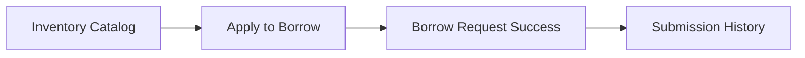

# Equipment Lending Flow

> Bagian dari [Information Architecture](./Information%20Architecture.md).

## Alur

## Layar

| Layar | File | Catatan |
|---|---|---|
| Katalog Peminjaman | `inventory_equipment_lending_ppit_nanjing`, `inventory_management_ppit_nanjing` | Daftar barang inventaris organisasi yang bisa dipinjam anggota (kamera, proyektor, perlengkapan event, dll) |
| Apply to Borrow Equipment | `apply_to_borrow_equipment_ppit_nanjing` | Form pengajuan: barang, jumlah, tanggal pinjam-kembali, keperluan |
| Borrow Request Success | `borrow_request_success_ppit_nanjing` (batch 2) | Konfirmasi pengajuan terkirim, status "pending approval" |

## Entitas terkait

[INVENTORY_ITEM](./Data%20Dictionary.md), [BORROW_REQUEST](./Data%20Dictionary.md)

## Terkait admin

Persetujuan/penolakan pengajuan ditangani di [Inventory Management](./Inventory%20Management.md) § Borrow Requests. Status berubah dari `pending` → `approved`/`rejected` → (jika approved) `borrowed` → `returned`/`overdue`.
