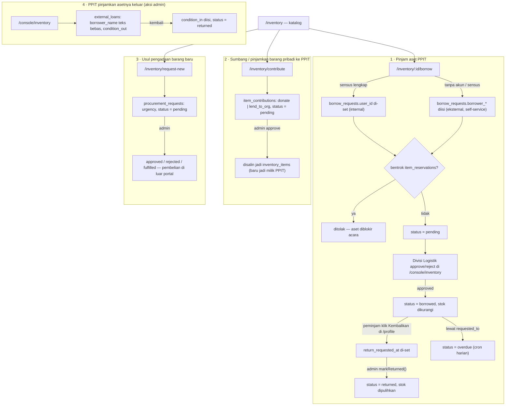

# Equipment Lending Flow

> Bagian dari [Information Architecture](./Information%20Architecture.md). Audit terhadap kode: **2026-09-09**. Awalnya cuma "pinjam", sekarang **empat arah** — lihat [Data Dictionary](./Data%20Dictionary.md) & ERD § 5.

## Empat arah

## Rute

| Rute | Isi |
|---|---|
| `/inventory` | Katalog aset yang bisa dipinjam + stok tersedia + kondisi |
| `/inventory/:id/borrow` | Form pengajuan: jumlah, tanggal pinjam-kembali, keperluan, **lokasi penggunaan**, unggah **Pernyataan Peminjam** bertanda tangan (PDF). Jalur internal & eksternal di form yang sama. |
| `/inventory/borrow/success` | Konfirmasi, status "menunggu persetujuan Divisi Logistik" |
| `/inventory/contribute` | Form sumbang (permanen) / pinjamkan sementara barang pribadi |
| `/inventory/request-new` | Form usul pengadaan — barang, alasan, estimasi biaya (RMB), urgensi. Ini **usulan**, pembelian tetap offline. |
| `/console/inventory` | Antrean approve/reject peminjaman, konfirmasi pengembalian, reservasi acara, catat peminjaman eksternal |
| `/console/inventory/audit-log` | `inventory_audit_logs` — added / adjusted / damaged / retired / lent_external / returned_external |

## Aturan

- **Internal vs eksternal** ditentukan otomatis: peminjam dengan sensus lengkap → `user_id` di-set; pihak luar → kontak diisi manual di `borrower_name/email/wechat/phone`, `user_id` NULL.
- **Reservasi acara** (`item_reservations`) memblokir seluruh aset di rentang `[reserved_from, reserved_to]` — pengajuan yang tanggalnya beririsan langsung ditolak.
- **Pengembalian dua langkah**: peminjam menandai "Kembalikan" (`return_requested_at`), admin yang benar-benar `markReturned()` dan memulihkan stok.
- **Overdue** diset cron harian (`/api/cron/mark-overdue`) untuk `borrow_requests` dan `external_loans` yang lewat tanggal kembali.
- Barang sumbangan **bukan milik PPIT** sampai admin approve `item_contributions` → disalin jadi `inventory_items`.

## Belum ada

Alur **perpanjangan** peminjaman, dokumen kondisi barang per-transaksi, dan penanganan error antar-antrean (lihat catatan review inventaris di memory).

## Terkait

[Inventory Management](./Inventory%20Management.md) · [Entity Relationship Diagram](./Entity%20Relationship%20Diagram.md) § 5
