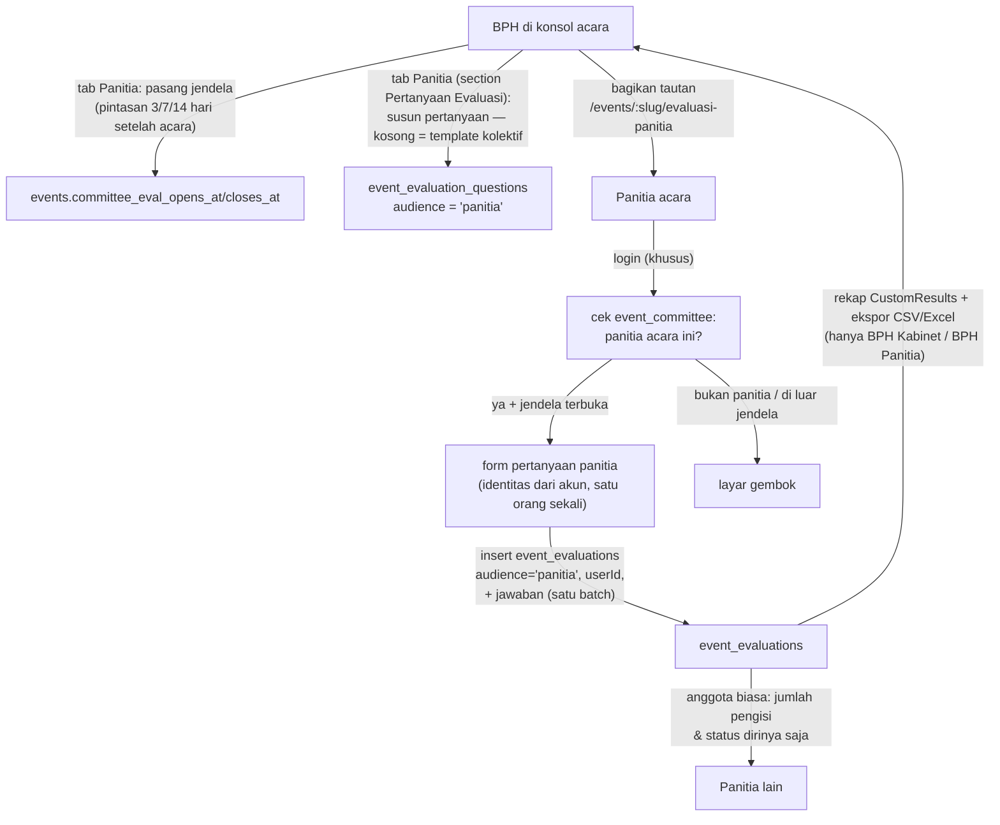

# Evaluasi Panitia Acara (Kolektif)

> Diperbarui: **2026-10-09** (bangun ulang di atas builder pertanyaan evaluasi + aturan akses B2, hasil code review `feat/forms-and-evaluasi-panitia`). Fitur hasil diskusi dengan BPH: evaluasi panitia memang alaminya per-acara, tetapi sasarannya KOLEKTIF (divisi/kepanitiaan secara keseluruhan) — bukan skor per orang — dan pengisiannya dikontrol BPH lewat jendela waktu, mis. "buka 1 minggu setelah acara".

## Ringkasan

Evaluasi panitia per-acara di dalam modul Kegiatan. Panitia acara login, sistem cek roster (`event_committee`), lalu menjawab pertanyaan evaluasi audiens **panitia** yang disusun BPH lewat builder di konsol (bawaannya: 5 penilaian Bintang 1–5 kolektif + 2 teks wajib + 1 opsional). Satu orang sekali mengisi, hanya selama jendela yang dipasang BPH. Rekap dan ekspor ada di tab **Panitia** pada section **Evaluasi Acara** di konsol acara — tanpa section tambahan.

Responsnya disimpan di tabel evaluasi yang SAMA dengan peserta (`event_evaluations`), dibedakan kolom `audience`: `peserta` (bawaan) atau `panitia`. Pertanyaannya juga satu tabel (`event_evaluation_questions.audience`). Tidak ada lagi tabel lima-kolom-tetap.

Beda dengan jalur evaluasi lain:

| Jalur | Sasaran | Pengisi | Diatur di |
|---|---|---|---|
| Evaluasi Acara (`/events/:slug/evaluasi`) | Peserta menilai acara | Publik + token perangkat | Template + builder pertanyaan (tab Peserta) |
| **Evaluasi Panitia Acara** (`/events/:slug/evaluasi-panitia`) | **Panitia menilai kolektif sendiri** | **Panitia acara (login + roster)** | **Jendela waktu di konsol acara (tab Panitia)** |

Modul Formulir generik (`/evaluation/committee`, penilaian per orang tanpa login) sudah DIHAPUS karena tumpang tindih dan tidak aman (temuan B3/D1 review).

## Alur

## Status jendela (tanpa cron)

Dihitung dari waktu saat ini oleh `committeeEvalWindowState()` (`src/lib/committee-evaluation.ts`):

| opens_at | closes_at | Status |
|---|---|---|
| NULL | NULL | `not-configured` — layar "belum dijadwalkan" |
| < now | — | `before` — layar "dibuka <waktu>" |
| — | > now | `open` (opens NULL = sudah dibuka, tutup manual) |
| — | < now | `closed` — layar "sudah ditutup" |

BPH bisa override kapan pun: majukan/mundurkan waktu, kosongkan keduanya lalu simpan untuk melepas jadwal. Server action `submitCommitteeEvaluation` menghitung ulang status yang sama — halaman bukan kontrol aksesnya.

## Data model (`src/db/schema.ts`)

- **`events`** — `committee_eval_opens_at`, `committee_eval_closes_at` (NULL = belum dipasang).
- **`event_evaluation_questions.audience`** — `text NOT NULL DEFAULT 'peserta'`, CHECK `IN ('peserta','panitia')`; builder konsol menyusun per audiens.
- **`event_evaluations`** — tambahan `audience` (default `'peserta'`, CHECK sama), `user_id` (set null, khusus panitia), `division_id` (**snapshot** divisi evaluator saat mengisi, set null). Dedup panitia: unique partial index `(event_id, user_id) WHERE audience = 'panitia'` + token `panitia:<userId>` yang menabrak unique `(event_id, responder_token)`.
- **`event_evaluations_answers`** — sama seperti peserta; `question_id` NULL untuk jawaban pertanyaan template (label/tipe disalin).
- Migrasi: `drizzle/0046_committee_evaluation_on_builder.sql` (idempoten), pembersihan tabel lama: `drizzle/0047_drop_unused_form_tables.sql` (khusus database yang pernah menerima eksperimen modul Formulir — dijalankan Haikal setelah cadangan).

## Pertanyaan

Sumber pertanyaan audiens panitia per acara: builder tab **Panitia** di section **Pertanyaan Evaluasi** konsol acara. Kalau belum ada satu pun, form publik & submit memakai template kolektif di `src/lib/committee-evaluation.ts` (`committeeEvalTemplateQuestions()`: lima pertanyaan Bintang 1–5 dari `COMMITTEE_EVAL_ASPECTS` + `COMMITTEE_EVAL_TEXT`). Tombol "Mulai dari template standar" di builder menyalinnya ke DB supaya bisa diedit. Label pertanyaan DB tidak diterjemahkan otomatis (konten DB, umumnya bahasa Indonesia).

## Tempat kode

| Berkas | Isi |
|---|---|
| `src/lib/committee-evaluation.ts` | Template kolektif + `committeeEvalWindowState()` + pintasan jendela (murni, client-safe) |
| `src/app/actions/committee-evaluation.ts` | `submitCommitteeEvaluation` (login + roster + jendela + validasi `validateEvalAnswer`, insert respons+jawaban satu batch), `saveCommitteeEvaluationWindow` (gerbang pengelola + form state), `deleteCommitteeEvaluation` (gerbang pengelola + audit log) |
| `src/app/actions/event-evaluation-questions.ts` | Builder per audiens: `saveEventEvaluationQuestion`/`deleteEventEvaluationQuestion`/`startEvaluationFromTemplate` (audience di FormData) |
| `src/app/events/[slug]/evaluasi-panitia/page.tsx` | Halaman publik: 4 status jendela + gerbang login/roster + layar "sudah mengisi" (`force-dynamic`); form-nya `EventEvaluationForm` dengan `audience="panitia"` |
| `src/components/events/event-evaluation-form.tsx` | Form klien bersama dua audiens: peserta (identitas + token perangkat) vs panitia (identitas dari kepanitiaan, tanpa token) |
| `src/components/console/committee-eval-window-editor.tsx` | Editor jendela di konsol: dua datetime-local + pintasan durasi (jam lokal, bukan UTC) + lepas jadwal; error dari form state |
| `src/components/console/eval-audience-tabs.tsx` | Switcher tab Peserta \| Panitia (client, konten dari server) |
| `src/app/console/events/[id]/page.tsx` | Section **Evaluasi Acara** (tab Peserta \| Panitia): editor jendela + rekap `CustomResults` untuk pengelola; anggota biasa hanya jumlah pengisi |
| `src/app/api/console/events/[id]/evaluasi/export/route.ts` | CSV/XLSX via `src/lib/report-export.ts`; `?audience=panitia` digerbang lebih ketat (B2) |

## Keamanan & hak akses (B2)

- Aksi kirim adalah batas permintaan publik: login, roster `event_committee`, dan status jendela dicek di dalam action. Bukan panitia yang sudah login dibedakan dari belum login (`not_committee` vs `login`); acara `cancelled` ditolak.
- Mengelola jendela, menghapus respons, dan mengekspor = **BPH Kabinet/Teknologi atau BPH Panitia acara ini** (`isFullAdmin || isBphPanitia`) — dicek di server action DAN route ekspor, bukan cuma disembunyikan di UI. Penghapusan dicatat di audit log (`committee_evaluation.deleted`).
- Baris & jawaban audiens panitia (termasuk nama pengisi) TIDAK di-query untuk viewer non-pengelola; mereka hanya menerima angka agregat (jumlah pengisi + status dirinya).
- Rekap peserta di tab Peserta menyaring `audience = 'peserta'` — jawaban panitia tidak ikut merusak rata-rata peserta, dan sebaliknya.
- Teks dibatasi 2000 karakter; skala (rating/bintang) divalidasi ulang di server lewat `validateEvalAnswer`; respons + jawaban ditulis dalam satu batch.
- `division_id` di-snapshot saat mengisi — agregat per divisi tetap benar walau penempatan berubah kemudian.

## Yang belum (follow-up)

- Artikel Help Center untuk pengisi/pengurus (via `/console/docs/new`) — konten DB, tidak bisa dibuat dari repo.
- Notifikasi otomatis ke panitia saat jendela buka (email/notification templates) — sekarang BPH membagikan tautan manual.
