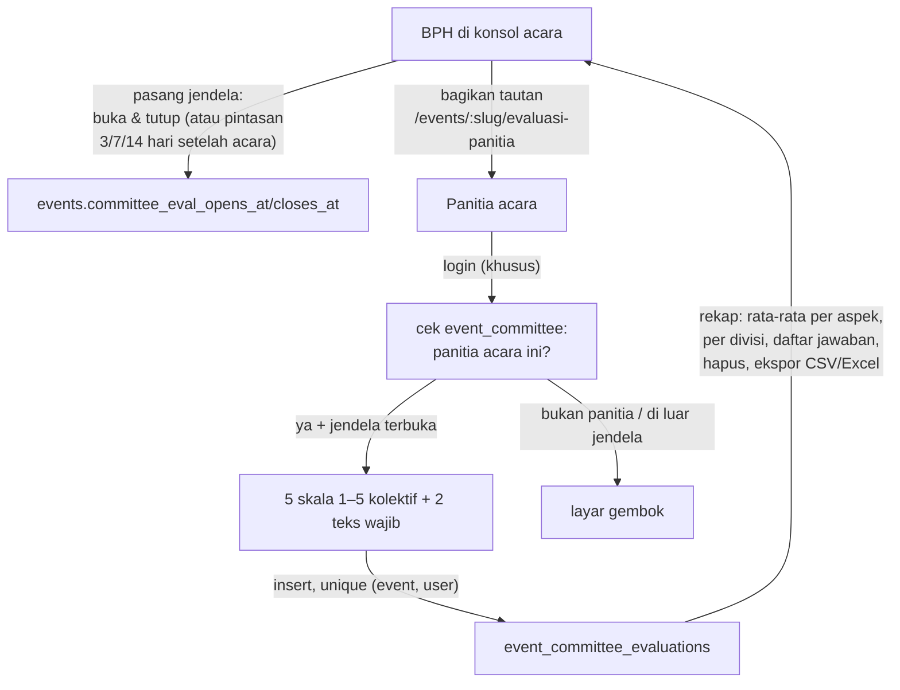

# Evaluasi Panitia Acara (Kolektif)

> Audit terhadap kode: **2026-10-07**. Fitur hasil diskusi dengan BPH: evaluasi panitia memang alaminya per-acara, tetapi sasarannya KOLEKTIF (divisi/kepanitiaan secara keseluruhan) — bukan skor per orang — dan pengisiannya dikontrol BPH lewat jendela waktu, mis. "buka 1 minggu setelah acara".

## Ringkasan

Evaluasi panitia per-acara di dalam modul Kegiatan. Panitia acara login, sistem cek roster (`event_committee`), lalu menilai 5 aspek kolektif (skala 1–5) + 2 catatan wajib + 1 opsional. Satu orang sekali mengisi, hanya selama jendela yang dipasang BPH di konsol kegiatan. Rekap (rata-rata per aspek, per divisi evaluator, daftar jawaban) dan ekspor CSV/Excel ada di section **Evaluasi Panitia (Kolektif)** pada halaman konsol acara.

Beda dengan dua jalur evaluasi lain:

| Jalur | Sasaran | Pengisi | Diatur di |
|---|---|---|---|
| Evaluasi Acara (`/events/:slug/evaluasi`) | Peserta menilai acara | Publik + token perangkat | Template + builder pertanyaan |
| **Evaluasi Panitia Acara** (`/events/:slug/evaluasi-panitia`) | **Panitia menilai kolektif sendiri** | **Panitia acara (login + roster)** | **Jendela waktu di konsol acara** |
| Formulir generik `/evaluation/committee` | Individu (nama diketik) | Publik + token perangkat | Editor template di `/console/forms` |

Formulir generik `/evaluation/committee` tetap ada untuk penilaian per-periode kepengurusan (mis. akhir semester); jalur per-acara ini untuk setelah tiap acara.

## Alur

## Status jendela (tanpa cron)

Dihitung dari waktu saat ini oleh `committeeEvalWindowState()` (`src/lib/committee-evaluation.ts`):

| opens_at | closes_at | Status |
|---|---|---|
| NULL | NULL | `not-configured` — layar "belum dijadwalkan" |
| < now | — | `before` — layar "dibuka &lt;waktu&gt;" |
| — | > now | `open` (opens NULL = sudah dibuka, tutup manual) |
| — | < now | `closed` — layar "sudah ditutup" |

BPH bisa override kapan pun: majukan/mundurkan waktu, kosongkan keduanya lalu simpan untuk melepas jadwal. Server action `submitCommitteeEvaluation` menghitung ulang status yang sama — halaman bukan kontrol aksesnya.

## Data model (`src/db/schema.ts`)

- **`events`** — dua kolom baru: `committee_eval_opens_at`, `committee_eval_closes_at` (NULL = belum dipasang).
- **`event_committee_evaluations`** — `event_id` (cascade), `user_id` (cascade — umpan balik internal, bukan arsip), `division_id` (**snapshot** divisi evaluator saat mengisi, set null), 5 kolom rating `integer NOT NULL` (coordination/teamwork/communication/workload/satisfaction), `went_well` + `to_improve` (`text NOT NULL`), `feedback` (nullable), `created_at`. Unique `(event_id, user_id)` — dedup lewat login, tanpa token perangkat.
- Migrasi: `drizzle/0046_event_committee_evaluation.sql`.

## Pertanyaan (placeholder)

Daftar satu-satunya ada di `src/lib/committee-evaluation.ts` (`COMMITTEE_EVAL_ASPECTS`, `COMMITTEE_EVAL_TEXT`) — ganti di sana saat BPH menetapkan pertanyaan aslinya; tidak perlu migrasi (kolom rating tetap lima; kalau jumlah aspek berubah, itu kerja skema). Label `labelKey` untuk UI (kamus `ceval.*` di dua locale), `label` versi Indonesia untuk header ekspor — pola sama dengan `event-evaluation-template.ts`.

Placeholder saat ini: koordinasi antar divisi, kerja sama & suasana tim, komunikasi dari panitia inti/BPH, pembagian tugas & beban kerja, kepuasan menjadi panitia (semua 1–5) + "Apa yang berjalan baik?" & "Apa yang perlu diperbaiki?" (wajib) + masukan tambahan (opsional).

## Tempat kode

| Berkas | Isi |
|---|---|
| `src/lib/committee-evaluation.ts` | Pertanyaan placeholder + `committeeEvalWindowState()` + pintasan jendela (murni, client-safe) |
| `src/app/actions/committee-evaluation.ts` | `submitCommitteeEvaluation` (login + roster + jendela), `saveCommitteeEvaluationWindow`, `deleteCommitteeEvaluation` (`requireEventConsoleAccess`) |
| `src/app/events/[slug]/evaluasi-panitia/page.tsx` | Halaman publik: 4 status jendela + gerbang login/roster + layar "sudah mengisi" (`force-dynamic`) |
| `src/components/events/committee-evaluation-form.tsx` | Form klien: skala 1–5 + teks, layar sukses |
| `src/components/console/committee-eval-window-editor.tsx` | Editor jendela di konsol: dua datetime-local + pintasan durasi + lepas jadwal |
| `src/app/console/events/[id]/page.tsx` | Section **Evaluasi Panitia (Kolektif)**: editor jendela, rekap per aspek & per divisi, daftar jawaban + hapus, tautan ekspor |
| `src/app/api/console/events/[id]/committee-evaluation/export/route.ts` | CSV/XLSX via `src/lib/report-export.ts` |
| `src/lib/i18n/dictionaries/{id,en}.ts` | Kunci `ceval.*` (krom UI dwibahasa; label pertanyaan di kode, bahasa Indonesia) |

## Keamanan & hak akses

- Aksi kirim adalah batas permintaan publik: login, roster `event_committee`, dan status jendela dicek di dalam action, bukan hanya di halaman.
- Editor jendela & tombol hapus/ekspor hanya untuk BPH Panitia acara (ketua/wakil/sekretaris/SC) + BPH Kabinet/Teknologi (`access.isFullAdmin || access.isBphPanitia`); ekspor juga digerbang ulang di route handler (`getEventAccess`).
- Rekap tampil untuk semua yang lolos gerbang konsol acara (sama seperti "Evaluasi Acara").
- Teks dibatasi 2000 karakter, rating 1–5 divalidasi ulang di server; jawaban salah isi tidak menyisakan baris kosong (satu insert atomik).
- `division_id` di-snapshot saat mengisi — agregat per divisi tetap benar walau penempatan berubah kemudian.

## Yang belum (follow-up)

- Artikel Help Center untuk pengisi/pengurus (via `/console/docs/new`) — konten DB, tidak bisa dibuat dari repo.
- Pertanyaan per-acara yang bisa diedit dari konsol (pola builder `evaluation-questions-builder.tsx`) — sengaja belum: pertanyaan placeholder cukup untuk uji coba, dan ganti pertanyaan cukup lewat satu berkas lib.
- Notifikasi otomatis ke panitia saat jendela buka (email/notification templates) — sekarang BPH membagikan tautan manual.