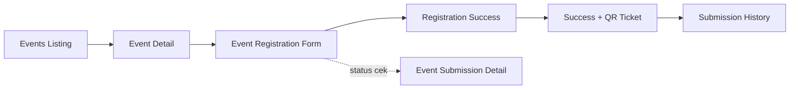

# Event Flow

> Bagian dari [Information Architecture](./Information%20Architecture.md).

## Alur lengkap

## Layar

| Layar | File prototipe | Catatan |
|---|---|---|
| Events (listing) | `events_ppit_nanjing`, kanonik `events_master_edition` (+ `_animated`, `_refined`) | Filter kategori, grid card |
| Event Detail | `event_details_ppit_nanjing` | Contoh konten: "Sumpah Pemuda Celebration Gala" |
| Event Registration | `event_registration_ppit_nanjing` | Form pendaftaran |
| Registration Success | `event_registration_success_ppit_nanjing` (batch 2) | Konfirmasi setelah submit |
| Registration Success + QR Ticket | `event_registration_success_qr_ticket_ppit_nanjing` (batch 2) | Tiket digital dengan QR untuk check-in |
| Event Submission Detail | `event_submission_detail_ppit_nanjing` (batch 2) | Detail satu pendaftaran (dilihat lagi dari riwayat) |
| Submission History | `submission_history_ppit_nanjing` (batch 2) | "Riwayat Pengajuan" — kemungkinan gabungan semua jenis pengajuan user (event, borrow, job), bukan event saja |

## Entitas terkait

[EVENT](./Data%20Dictionary.md), [EVENT_REGISTRATION](./Data%20Dictionary.md) — `qr_code_token` di-generate saat status `confirmed`, dipakai admin untuk check-in lewat [Event Management](./Event%20Management.md) § Manage Registrations / Attendance Report.

## Catatan implementasi

- QR code **wajib di-generate di server** (Edge Function), bukan di client, supaya token tidak bisa dipalsukan — lihat [Tech Stack](./Tech%20Stack.md).
- "Submission History" kemungkinan adalah halaman gabungan lintas-domain (event + borrow + job) — pertimbangkan sebagai satu view yang query beberapa tabel (`EVENT_REGISTRATION`, `BORROW_REQUEST`, `JOB_APPLICATION`) filtered by `user_id`, bukan tabel tersendiri.

## Terkait admin

[Event Management](./Event%20Management.md)
