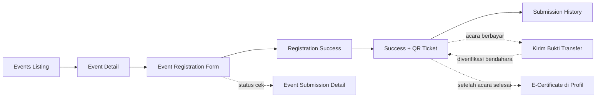

# Event Flow

> Bagian dari [Information Architecture](./Information%20Architecture.md).

## Alur lengkap

## Layar

| Layar | File prototipe | Catatan |
|---|---|---|
| Events (listing) | `events_ppit_nanjing`, kanonik `events_master_edition` (+ `_animated`, `_refined`) | Filter kategori, grid card |
| Event Detail | `event_details_ppit_nanjing` | Contoh konten: "Sumpah Pemuda Celebration Gala" |
| Event Registration | `event_registration_ppit_nanjing` | Form pendaftaran |
| Registration Success | `event_registration_success_ppit_nanjing` (batch 2) | Konfirmasi setelah submit |
| Registration Success + QR Ticket | `event_registration_success_qr_ticket_ppit_nanjing` (batch 2) | Tiket digital dengan QR untuk check-in |
| Event Submission Detail | `event_submission_detail_ppit_nanjing` (batch 2) | Detail satu pendaftaran (dilihat lagi dari riwayat) |
| Submission History | `submission_history_ppit_nanjing` (batch 2) | "Riwayat Pengajuan" — kemungkinan gabungan semua jenis pengajuan user (event, borrow, job), bukan event saja |

## Entitas terkait

[EVENT](./Data%20Dictionary.md), [EVENT_REGISTRATION](./Data%20Dictionary.md), [CERTIFICATE](./Data%20Dictionary.md) — `qr_code_token` di-generate saat status `confirmed`, dipakai admin untuk check-in lewat [Event Management](./Event%20Management.md) § Manage Registrations / Attendance Report.

## Acara berbayar (HTM)

Jika event ditandai berbayar, registrasi berlanjut ke pembayaran manual — tanpa payment gateway:

1. Peserta transfer sesuai instruksi bayar di detail/tiket event (opsional: deep-link Alipay yang sudah terisi nominal + memo).
2. Dari halaman tiket (`/events/[slug]/ticket`) ia mengirim tautan bukti transfer.
3. Bendahara acara memverifikasi dari konsol (`/console/events/[id]`); status (`belum bayar` → `sudah kirim bukti` → `terverifikasi`/`ditolak`) bisa dilihat lagi dari Submission Detail.

Pembayaran dihitung **perorangan**: satu pendaftaran satu tanggungan bayar, tidak ada pembayaran berkelompok. Detail sisi admin ada di [Event Management](./Event%20Management.md) § HTM.

## Setelah acara: e-certificate & riwayat

- **Semua peserta dapat e-certificate** secara bawaan — panitia menekan satu tombol "Terbitkan Sertifikat Peserta" di konsol untuk menerbitkan sekaligus (checkbox di acara bisa mematikannya untuk acara tanpa sertifikat). Sertifikat tambahan (juara, panitia, pemateri) diterbitkan manual lewat Work Ledger, lihat [Event Management](./Event%20Management.md) § Sertifikat.
- Sertifikat yang sudah terbit tampil di **profil user**. Profil menyediakan dua akses riwayat:
  - **E-Sertifikat** — semua sertifikat yang pernah diterima user;
  - **Riwayat Acara** — acara yang pernah diikuti; saat ini tergabung dalam Riwayat Pengajuan lintas-domain di `/profile/submissions` (lihat catatan implementasi di bawah).

## Catatan implementasi

- QR code **wajib di-generate di server** (Edge Function), bukan di client, supaya token tidak bisa dipalsukan — lihat [Tech Stack](./Tech%20Stack.md).
- "Submission History" kemungkinan adalah halaman gabungan lintas-domain (event + borrow + job) — pertimbangkan sebagai satu view yang query beberapa tabel (`EVENT_REGISTRATION`, `BORROW_REQUEST`, `JOB_APPLICATION`) filtered by `user_id`, bukan tabel tersendiri. **Status implementasi:** sudah jadi `/profile/submissions` dengan pola persis itu.
- **Status:** E-Sertifikat sudah tampil di `/profile` (bagian E-Sertifikat, via `getMyCertificates`). Riwayat acara tercakup di `/profile/submissions`; kalau mau tab terpisah khusus acara, tinggal filter `kind=event` dari view yang sama.

## Terkait admin

[Event Management](./Event%20Management.md)
