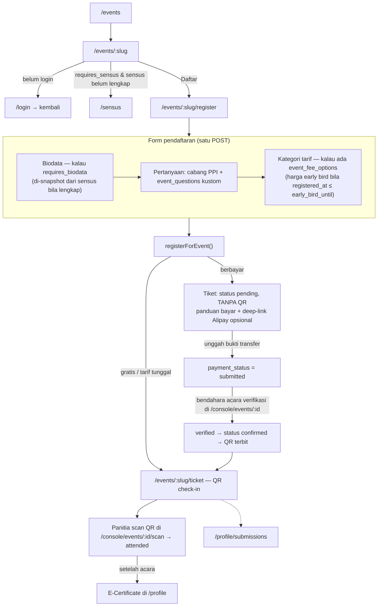

# Event Flow

> Bagian dari [Information Architecture](./Information%20Architecture.md). Audit terhadap kode: **2026-09-09**.

## Alur pendaftaran

## Rute

| Rute | Isi |
|---|---|
| `/events` | Listing, filter kategori, badge kapasitas/deadline |
| `/events/:slug` | Detail. Dua wajah: pra-acara (kapasitas X/Y, tombol daftar) vs pasca-acara (kehadiran nyata, dokumentasi, recap). |
| `/events/:slug/register` | `EventRegisterWizard` — per-section (Biodata → Pertanyaan → Tarif), Back/Next, satu `<form>` yang POST sekali |
| `/events/:slug/ticket` | Tiket peserta: QR check-in **atau** panduan bayar + unggah bukti. Menampilkan `confirmation_info` (mis. "add WeChat ini untuk masuk grup"). |
| `/events/:slug/committee` | Tiket kepanitiaan — QR absensi, muncul kalau user punya baris `event_committee` di acara ini |
| `/console/events/:id` | Sisi admin: pendaftar, verifikasi pembayaran, kategori tarif, "Setelah Acara" |
| `/console/events/:id/scan` | Scanner kamera — coba `qr_code_token` peserta dulu, fallback ke `attendance_token` panitia |

## Acara berbayar (HTM)

Kalau `events.is_paid`, pendaftaran masuk **`pending` tanpa QR**. Peserta transfer manual → unggah screenshot di halaman tiket → **bendahara acara** (bukan bendahara kabinet) memverifikasi di console. Set `verified` → pendaftaran naik ke `confirmed` → **QR check-in terbit seketika**. Itu satu-satunya pintu QR untuk acara berbayar.

Pembayaran **perorangan** — satu pendaftaran satu tanggungan. Tidak ada payment gateway: Alipay/WeChat Pay butuh merchant account berbadan hukum Tiongkok, QR pribadi tidak punya webhook. Deep-link `alipays://` yang mengisi nominal otomatis (`events.alipay_uid`) hanya mengurangi ketik, verifikasi tetap 100% manual.

## Kategori tarif & early bird

- Nol baris `event_fee_options` → tarif tunggal `events.fee_cny` (atau gratis).
- ≥1 baris → peserta memilih satu kategori saat mendaftar; nominal dibaca dari opsinya, tidak disalin ke pendaftaran.
- `event_fee_options.quota` membatasi per kategori — satu kategori penuh, kategori lain jalan terus.
- Early bird: sampai `events.early_bird_until`, pendaftar kena `early_bird_amount_cny` (bila diisi). Tier dihitung live dari `registered_at`, jadi menggeser tanggal ikut menggeser harga pendaftar lama.

## Biodata lengkap (`requires_biodata`)

Acara seperti WIF perlu menyetor daftar peserta lengkap ke sistem pusat. Peserta yang sensusnya sudah lengkap **tidak mengetik ulang** — biodatanya di-snapshot dari `sensus_profiles` (`source:"sensus"`). Yang lain isi `EventBiodataFields` inline (`source:"form"`), di-prefill dari sensus/akun sebagian. Dibekukan di `event_registrations.biodata_json` supaya ekspor selalu utuh.

## Pertanyaan kustom

Admin bisa menambah pertanyaan per acara (`event_questions`): teks, textarea, select, radio, multiselect, `file` (unggah satu berkas). Jawaban di `event_registrations.answers_json`, tampil ke admin di daftar pendaftar & ekspor.

## Setelah acara: sertifikat & riwayat

- **Semua peserta dapat e-certificate** secara bawaan (`events.certificate_for_participants`, checkbox bisa mematikannya). Penerbitan tetap manual — satu tombol "Terbitkan Sertifikat Peserta" di console. Sertifikat panitia/pemateri/juara diterbitkan manual lewat Work Ledger.
- `/profile` menampilkan **E-Sertifikat** (semua `certificates` user) + **Riwayat Acara** (semua `event_registrations`, terbaru dulu). Riwayat lintas-domain (pinjam barang, lamaran kerja) di `/profile/submissions`.

## Terkait

[Event Management](./Event%20Management.md) · [Entity Relationship Diagram](./Entity%20Relationship%20Diagram.md) § 3
