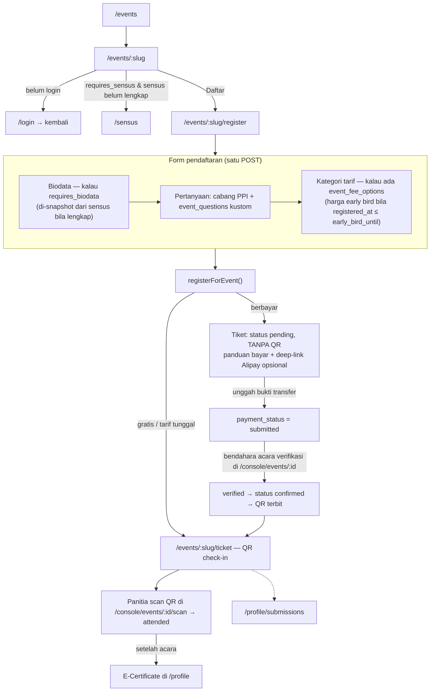

# Event Flow

> Bagian dari [Information Architecture](./Information%20Architecture.md). Audit terhadap kode: **2026-09-09**.

## Alur pendaftaran

```mermaid
flowchart TD
    List["/events"] --> Detail["/events/:slug"]
    Detail -->|belum login| Login["/login → kembali"]
    Detail -->|requires_sensus & sensus belum lengkap| Sensus["/sensus"]
    Detail -->|"Daftar"| Reg["/events/:slug/register"]

    subgraph Wizard["Form pendaftaran (satu POST)"]
        Bio["Biodata — kalau requires_biodata<br/>(di-snapshot dari sensus bila lengkap)"]
        Qs["Pertanyaan: cabang PPI + event_questions kustom"]
        Fee["Kategori tarif — kalau ada event_fee_options<br/>(harga early bird bila registered_at ≤ early_bird_until)"]
        Bio --> Qs --> Fee
    end
    Reg --> Wizard --> Submit["registerForEvent()"]

    Submit -->|gratis / tarif tunggal| Ticket["/events/:slug/ticket — QR check-in"]
    Submit -->|berbayar| Pending["Tiket: status pending, TANPA QR<br/>panduan bayar + deep-link Alipay opsional"]
    Pending -->|"unggah bukti transfer"| Proof["payment_status = submitted"]
    Proof -->|"bendahara acara verifikasi di /console/events/:id"| Verified["verified → status confirmed → QR terbit"]
    Verified --> Ticket

    Ticket --> Attend["Panitia scan QR di /console/events/:id/scan → attended"]
    Attend -->|setelah acara| Cert["E-Certificate di /profile"]
    Ticket -.-> History["/profile/submissions"]
```

## Rute

| Rute | Isi |
|---|---|
| `/events` | Listing, filter kategori, badge kapasitas/deadline |
| `/events/:slug` | Detail. Dua wajah: pra-acara (kapasitas X/Y, tombol daftar) vs pasca-acara (kehadiran nyata, dokumentasi, recap). |
| `/events/:slug/register` | `EventRegisterWizard` — per-section (Biodata → Pertanyaan → Tarif), Back/Next, satu `<form>` yang POST sekali |
| `/events/:slug/ticket` | Tiket peserta: QR check-in **atau** panduan bayar + unggah bukti. Menampilkan `confirmation_info` (mis. "add WeChat ini untuk masuk grup"). |
| `/events/:slug/committee` | Tiket kepanitiaan — QR absensi, muncul kalau user punya baris `event_committee` di acara ini |
| `/console/events/:id` | Sisi admin: pendaftar, verifikasi pembayaran, kategori tarif, "Setelah Acara" |
| `/console/events/:id/scan` | Scanner kamera — coba `qr_code_token` peserta dulu, fallback ke `attendance_token` panitia |

## Acara berbayar (HTM)

Kalau `events.is_paid`, pendaftaran masuk **`pending` tanpa QR**. Peserta transfer manual → unggah screenshot di halaman tiket → **bendahara acara** (bukan bendahara kabinet) memverifikasi di console. Set `verified` → pendaftaran naik ke `confirmed` → **QR check-in terbit seketika**. Itu satu-satunya pintu QR untuk acara berbayar.

Pembayaran **perorangan** — satu pendaftaran satu tanggungan. Tidak ada payment gateway: Alipay/WeChat Pay butuh merchant account berbadan hukum Tiongkok, QR pribadi tidak punya webhook. Deep-link `alipays://` yang mengisi nominal otomatis (`events.alipay_uid`) hanya mengurangi ketik, verifikasi tetap 100% manual.

## Kategori tarif & early bird

- Nol baris `event_fee_options` → tarif tunggal `events.fee_cny` (atau gratis).
- ≥1 baris → peserta memilih satu kategori saat mendaftar; nominal dibaca dari opsinya, tidak disalin ke pendaftaran.
- `event_fee_options.quota` membatasi per kategori — satu kategori penuh, kategori lain jalan terus.
- Early bird: sampai `events.early_bird_until`, pendaftar kena `early_bird_amount_cny` (bila diisi). Tier dihitung live dari `registered_at`, jadi menggeser tanggal ikut menggeser harga pendaftar lama.

## Biodata lengkap (`requires_biodata`)

Acara seperti WIF perlu menyetor daftar peserta lengkap ke sistem pusat. Peserta yang sensusnya sudah lengkap **tidak mengetik ulang** — biodatanya di-snapshot dari `sensus_profiles` (`source:"sensus"`). Yang lain isi `EventBiodataFields` inline (`source:"form"`), di-prefill dari sensus/akun sebagian. Dibekukan di `event_registrations.biodata_json` supaya ekspor selalu utuh.

## Wajib sensus lengkap (`requires_sensus`)

Acara seperti Fun Hike hanya menerima pendaftar yang sensusnya lengkap. Karena datanya sudah ada, pertanyaan "Asal Kota di Tiongkok", "Asal Universitas/Kampus", dan "WeChat ID" **tidak ditanya ulang** di form — roster console dan ekspor CSV mengisi kota, kampus, serta WeChat dari `sensus_profiles` (kota fallback ke jawaban satu-kali di pendaftaran bila sensus tidak lengkap).

## Pertanyaan kustom

Admin bisa menambah pertanyaan per acara (`event_questions`): teks, textarea, select, radio, multiselect, `file` (unggah satu berkas). Jawaban di `event_registrations.answers_json`, tampil ke admin di daftar pendaftar & ekspor. Di console ada **Pratinjau form pendaftaran** (details di section Pertanyaan Pendaftaran) yang merender pertanyaan dengan komponen field yang sama dengan form publik (`src/components/events/event-question-fields.tsx`); semua kontrol nonaktif dan tidak ada data yang terkirim/tersimpan.

## Mode Latihan (uji form pendaftaran)

Panitia/admin bisa mencoba form pendaftaran tanpa mendaftar sungguhan: buka `/events/<slug>/register?practice=1` (tombol **Coba Form Pendaftaran (Mode Latihan)** di kotak "Panitia" pada halaman acara). Syaratnya akses konsol acara itu (BPH/modul Kegiatan atau peran panitia); untuk orang lain `?practice=1` diabaikan dan form berjalan normal.

- Validasi **sama persis** dengan pendaftaran asli (`runRegistration` di `src/app/actions/events.ts`, dipakai bersama oleh `registerForEvent` dan `registerForEventPractice`): pertanyaan wajib, kategori tarif, kuota total/per kategori, kelengkapan biodata.
- **Tidak ditulis apa pun**: tidak ada baris `event_registrations`, tidak ada notifikasi, tidak ada pencerminan biodata ke `sensus_profiles`. Satu pengecualian: berkas yang diunggah lewat field `file`/bukti mahasiswa tetap masuk penyimpanan Blob.
- Jalan di status acara apa pun (draf, ditutup, selesai), melewati pantulan "sudah terdaftar", "wajib sensus", "penuh" dan "lewat tenggat" yang berlaku untuk peserta.
- Hasil kembali sebagai `?practice=1&done=confirmed|pending|full` (QR langsung terbit / menunggu verifikasi pembayaran / kuota penuh); galat validasi memakai `?err=` yang sama dengan form asli. Padanan untuk scan kehadiran: `/events/<slug>/scan?practice=1`.

## Setelah acara: sertifikat & riwayat

### Aturan sertifikat

1. **Tidak ada sertifikat tanpa tautan berkas.** Aplikasi tidak membuat PDF; PDF dibuat di luar (Canva/Word) dan **tautannya wajib ada saat sertifikat diterbitkan**. Barisnya baru dibuat saat tautan disimpan, jadi tidak pernah ada sertifikat kosong. Tautan harus `https://` (ditampilkan sebagai `<a href>` di profil penerima, jadi `http:`, `javascript:`, dan `data:` ditolak server; lihat `src/lib/certificate-links.ts`). Pakai penyimpanan yang bisa dibuka dari Tiongkok: Google Drive sering terblokir tanpa VPN.
2. **Sertifikat peserta hanya untuk yang kehadirannya tercatat**: status pendaftaran `attended`, artinya QR-nya sudah di-scan di acara. `confirmed` saja tidak cukup. Acara yang kehadirannya tidak di-scan tidak menghasilkan sertifikat peserta sampai kehadiran dicatat.
3. **Sertifikat panitia** untuk semua anggota kepanitiaan acara itu (`event_committee`); judulnya dirakit dari peran + divisi + acara (`src/lib/certificate-title.ts`).
4. Menandai acara **Selesai tidak lagi menerbitkan** sertifikat otomatis (dulu ya): tautan berkasnya per orang, jadi tidak bisa dibuat otomatis.
5. Sertifikat tanpa berkas (sisa dari aturan lama) tetap tersimpan tapi **tidak tampil** di profil dan tidak dihitung terbit; menempel tautan padanya membuatnya terbit (tanpa notifikasi ulang).

### Cara menerbitkan (panitia)

Di konsol acara (kapabilitas `event.issueCertificates`: BPH Panitia, atau divisi yang diberi hak "Sertifikat", atau BPH Kabinet):

- Section **Sertifikat Peserta** dan **Sertifikat Panitia**: daftar orang yang berhak, tiap baris punya kolom tautan; tombol **Terbitkan** menyimpan tautan dan menerbitkan (notifikasi + muncul di profil). Menyimpan tautan lain pada yang sudah terbit hanya memperbarui tautannya.
- **Tempel banyak sekaligus**: satu orang per baris, `email atau nama lengkap` lalu tautan (dipisah tab/koma/spasi). Server mencocokkan ke daftar yang berhak, dan melaporkan per baris yang tidak ditemukan, ganda (pakai email), atau bukan yang berhak; maksimal 300 baris.
- **Folder sertifikat (massal)**: simpan satu tautan folder (`events.certificate_folder_peserta_url` / `_panitia_url`, migrasi `0045`) di section yang sama, lalu **Terbitkan semua yang berhak** memasang tautan folder itu ke seluruh daftar berhak sekaligus — yang belum punya dibuat + notifikasi, yang sudah punya hanya tautannya diperbarui (tanpa notifikasi ulang), jadi aman diklik ulang setelah ada peserta/panitia baru. Cocok kalau semua PDF dikumpulkan dalam satu folder Drive; tautan per-orang tetap menang kalau ada yang berbeda.
- Sertifikat lepas (pemateri, juara, dll.): **Work Ledger → Sertifikat**; tautan wajib juga di sana.
- Kode: `src/app/actions/committee.ts` (`issueCertificateWithLink`, `saveCertificateLinksBulk`, `updateCertificateFileUrl`, `issueCertificate`), UI di `src/components/console/certificate-roster.tsx` dan `certificate-bulk-form.tsx`.

### Yang dilihat peserta/panitia

- `/profile` menampilkan **E-Sertifikat** (hanya `certificates` user yang sudah bertautan berkas, dengan tautan untuk membukanya) + **Riwayat Acara** (semua `event_registrations`, terbaru dulu). Riwayat lintas-domain (pinjam barang, lamaran kerja) di `/profile/submissions`. Notifikasi "sertifikat terbit" dikirim saat sertifikat dibuat.

## Terkait

[Event Management](./Event%20Management.md) · [Entity Relationship Diagram](./Entity%20Relationship%20Diagram.md) § 3
