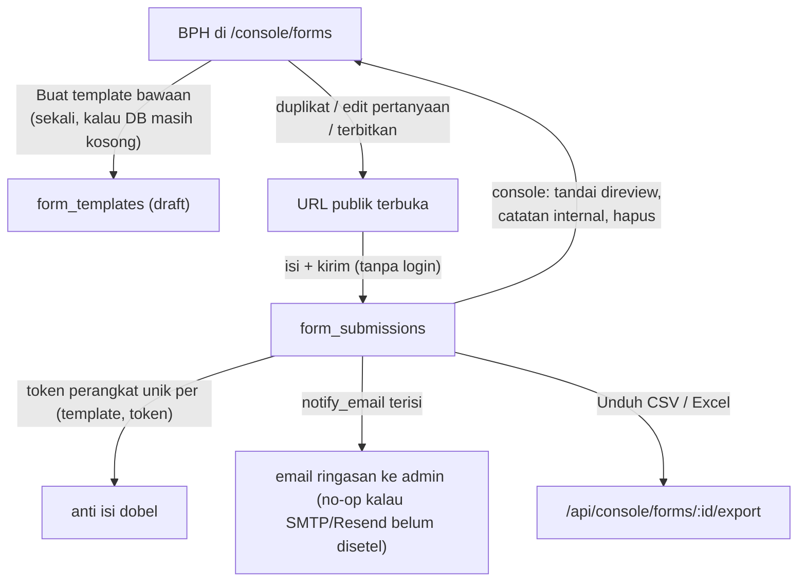

# Formulir BPH (pengganti Google Forms internal)

> Audit terhadap kode: **2026-10-05**. Fitur dibangun dari brief `i.txt` (rekrutmen + evaluasi panitia + evaluasi peserta), diintegrasikan ke stack repo (Next.js 16, Drizzle/Neon, console) — **tanpa** Supabase.

## Ringkasan

Sistem formulir multi-template yang menggantikan Google Forms untuk alur internal BPH. Setiap template punya URL publik sendiri, pertanyaan diedit dari console tanpa ganti kode, dan jawaban direview (dicentang, diberi catatan internal) lalu diekspor CSV/Excel.

| URL publik | Slug template | Isi placeholder |
|---|---|---|
| `/recruitment` | `recruitment` | Rekrutmen pengurus: data diri, motivasi, skill, CV upload, persetujuan |
| `/evaluation/committee` | `evaluation-committee` | Evaluasi anggota panitia: 6 skala 1–5 + catatan teks |
| `/evaluation/participant` | `evaluation-participant` | Evaluasi peserta acara: 5 skala 1–5 + masukan teks |

Slug → halaman publik dipetakan di `formPublicPath()` (`src/lib/form-templates.ts`). Template dengan slug lain (hasil duplikat) belum punya halaman publik otomatis — hubungkan lewat short link atau tambahkan pemetaan + page baru.

## Alur

## Data model (`src/db/schema.ts`)

- **`form_templates`** — `slug` (unique), `title`, `description`, `status` (`draft | published | closed`), **`sections` jsonb** (daftar bagian → pertanyaan), `success_message`, `notify_email`, timestamps.
- **`form_submissions`** — FK ke template (cascade), **`answers` jsonb** (`Record<fieldId, string | number | string[]>`), `responder_token` (anti dobel; unique `(template_id, responder_token)`), `submitter_user_id` (nullable, kalau pengisi kebetulan login), `reviewed` + `reviewed_by` + `reviewed_at`, `internal_note`.
- Tipe pertanyaan (`form_field_type`): `short_text, paragraph, email, tel, number, date, select, radio, multiselect, scale, file`.
- Migrasi: `drizzle/0045_form_templates.sql` (enum + 2 tabel + unique index).

Jawaban dikunci ke **field id**. Mengganti label/urutan aman; mengganti id membuat jawaban lama tak tampil lagi di console (tetap tersimpan di DB dan di ekspor yang pernah diunduh).

## Tempat kode

| Berkas | Isi |
|---|---|
| `src/lib/form-templates.ts` | Definisi 3 template placeholder (satu-satunya sumber seed), `formPublicPath()` |
| `src/components/forms/form-template-form.tsx` | Renderer publik semua tipe field + validasi klien + layar sukses |
| `src/components/forms/public-form-page.tsx` | Kerangka halaman publik (nav/header/status ditutup) |
| `src/app/recruitment/page.tsx`, `src/app/evaluation/{committee,participant}/page.tsx` | Tiga halaman publik (`force-dynamic`) |
| `src/app/actions/forms.ts` | `submitFormTemplate` (publik), CRUD template, review/note/hapus jawaban (`requireModuleAccess("forms")` semua aksi admin) |
| `src/app/console/forms/page.tsx` | Daftar template + status + duplikat + buat bawaan |
| `src/app/console/forms/[id]/page.tsx` | Setelan, editor pertanyaan, daftar jawaban, unduh ekspor |
| `src/components/console/forms/template-editor.tsx` | Editor section/pertanyaan (tambah/hapus/pindah, opsi, skala) |
| `src/components/console/forms/form-submissions-list.tsx` | Cari, filter status review, urutkan, tandai review, catatan, hapus |
| `src/app/api/console/forms/[id]/export/route.ts` | CSV (BOM+CRLF, anti formula-injection) & XLSX via `src/lib/report-export.ts` |
| `src/app/api/upload/route.ts` | Folder anon `form-doc` (PDF/gambar ≤10 MB) untuk field `file` |

## Kustomisasi tanpa ganti kode

1. Buka `/console/forms` → **Kelola** pada template.
2. Ubah judul/deskripsi/pesan sukses/status/email notifikasi di **Setelan**.
3. Di **Pertanyaan**: tambah/hapus/pindah bagian & pertanyaan, ganti label, tipe, opsi dropdown (satu per baris), nilai maks skala, tanda wajib.
4. Simpan — halaman publik langsung mengikuti (`revalidatePath`).
5. Versi tahunan: **Duplikat template** di halaman daftar → slug baru (mis. `recruitment-2027`) → edit pertanyaan → terbitkan.

Pertanyaan placeholder saat ini masih contoh dari brief — daftar lengkapnya ada di `FORM_TEMPLATE_DEFAULTS` (`src/lib/form-templates.ts`); yang wajib diganti sebelum dipakai serius: opsi divisi rekrutmen, dan pertanyaan evaluasi sesuai kebijakan BPH.

## Seed

Tidak ada script seed khusus. Tombol **"Buat template bawaan"** di `/console/forms` menyisipkan `FORM_TEMPLATE_DEFAULTS` yang belum ada (idempoten per slug, dibuat sebagai draft). Tidak ada penulisan DB saat render — semua lewat Server Action.

## Keamanan

- Semua aksi admin dan route ekspor bergate `requireModuleAccess("forms")` / `hasModuleAccess(..., "forms")` di dalam action/handler (UI bukan kontrol akses).
- Pengisi publik anonim: identitas apa adanya dari isian form; anti dobel pakai token perangkat (localStorage) + unique index — kalau localStorage dibersihkan bisa isi lagi (batas lunak, pola sama dengan evaluasi acara).
- Upload anon lewat folder `form-doc`: cek origin (CSRF), allowlist tipe (PDF/PNG/JPG/WebP), batas 10 MB, nama file disanitasi + suffix acak. Validasi jawaban server-side per tipe (email regex, opsi harus dari daftar, URL file harus blob Vercel/publik path internal).
- Modul `forms` delegable (bukan sensitive scope) — bisa diberikan ke divisi lewat checkbox scope Organisasi.
- Ekspor memakai pola `report-export` (escaping + netralisasi formula `= + - @`).

## Catatan linting / aksesibilitas

- Form publik punya label eksplisit, `aria-invalid` (input/textarea/select), legend untuk skala & pilihan, focus ring konsisten dengan komponen lain.
- Layar "sudah mengisi" menggantikan form (pola evaluasi acara), menghormati token perangkat tanpa akun.

## Yang belum (follow-up)

- Artikel Help Center untuk pengisi/pengurus (buat via `/console/docs/new`, aktifkan tampil publik bila relevan untuk anggota) — konten DB, tidak bisa dibuat dari repo.
- Halaman publik untuk slug duplikat (mis. per-periode) — sekarang lewat short link `/l/...` ke form yang sama atau tambah pemetaan `formPublicPath`.
- Multi-step + progress bar (opsional di brief) — sengaja belum: satu halaman dengan section sudah memenuhi; wizard ada polanya di `EventRegisterWizard` bila nanti diperlukan.
