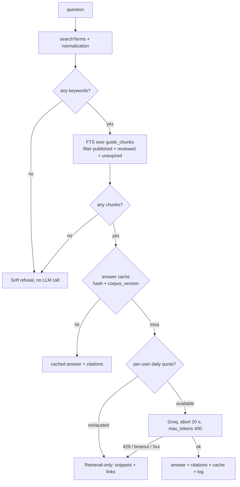

# Guidebook Maba

> Implementation plan for **issue #65 — "Guidebook untuk maba: AI atau interaktif"**.
> Status: **plan; retrieval half shipped, P0–P2 done.** Branch `feat/chatbot` already merges the chatbot part of step 1 below: `src/lib/guidebook-search.ts` (new), changes to `src/app/actions/ai.ts` and `src/lib/groq.ts`, and the "Chatbot Help Center" section of [Documentation & Help Center](./Documentation%20&%20Help%20Center.md). P0 landed on the same branch (see the phase table). P1 added `drizzle/0046_guidebook.sql`, the schema mirror, `src/lib/guide-chunker.ts`, `src/lib/markdown-lite.tsx`, and `scripts/check-guidebook.ts`. P2 added the console side: `src/app/console/docs/guidebook/` (topic list + diagnostics), the topic form (`article-form.tsx`, `markdown-editor.tsx`), and topic actions in `src/app/actions/admin-docs.ts`. No migration has been applied to a real database yet, and no topic has been saved from a browser — see "Verification and Definition of Done" for what P2 has actually been run against. Still to build: P3–P4 — checklist progress per account, retrieval wiring, and the staged-guide UI.
> Related: [Documentation & Help Center](./Documentation%20&%20Help%20Center.md), [Data Dictionary](./Data%20Dictionary.md), [Entity Relationship Diagram](./Entity%20Relationship%20Diagram.md), [Tech Stack](./Tech%20Stack.md), [Sensus Profile Flow](./Sensus%20Profile%20Flow.md), [Information Architecture](./Information%20Architecture.md).

## Summary

The maba guidebook is a **staged guide (checklist) plus a Q&A that answers only from the guidebook's own content.** Content is authored by pengurus from the console with no deploy, and can come either from the 5 existing PDF guides (150 pages) or be written directly in the console.

The principle: **content first, AI second.** AI answers are only as good as the content, and visa/residence-permit questions must never be answered from thin air — that is guaranteed by data (a topic must be reviewed and must have an expiry date), not by politely asking the prompt to behave.

## Architecture decisions

| Decision | Rationale | Consequence |
|---|---|---|
| **Markdown is the text SSoT**, stored per **topic** in `help_articles.content` (Postgres) | It is the only format that is pleasant for a human to edit in the console, and the review unit must equal the retrieval unit (per topic) | Needs a markdown renderer; `seed-help-articles.ts:235` ("teks biasa, tidak ada markdown") must be updated |
| **PDF is provenance, not SSoT** | The 5 PDFs are one-off parse input; pengurus edit the result | PDFs live in Drive plus a hash so re-parsing is reproducible |
| **Page numbers ride along as text markers**, not as structured JSON | Page numbers are machine data (must be exact for citations), prose is human text | The datalab extractor already emits one `{12}------------` rule per page; the chunker reads the range off it, and also honours a hand-written `[[p12]]` |
| **No embeddings / no vector DB** | Groq has no embeddings endpoint → new vendor, new key, re-embed cost on every change | Lexical retrieval (Postgres FTS); the upgrade path is documented, not built now |
| **`parsed_markdown` (upstream) ≠ `content` (live)** | Re-ingest must never overwrite pengurus corrections | Needs a per-topic merge panel in the console |
| **Retrieval-only is a success path**, not an error | The free Groq quota (8.000 TPM) will be hit during maba season | The endpoint returns guide snippets + links whenever the LLM is unavailable |
| **Revision history reuses `audit_logs`** | The table and its write pattern already exist (`src/lib/event-audit.ts`, `admin-departments.ts`) | No new revision table; retention needs a pruning policy |

## Scope

### First version

- Public `/guidebook` page: staged guide (before departure → first week → first month) rendered as a checklist.
- Per-account progress (`guidebook_progress`), idempotent, storing only completed steps.
- Pengurus can add/edit/review/publish topics from the console without a deploy.
- Q&A (the existing `chatWithAIAction` path) that answers **only** from published + reviewed + unexpired topics.
- Retrieval-only degradation path, per-user quota, answer cache, FAQ prewarm.
- This doc + a `docs/README.md` entry + a Help Center article as the pengurus SOP.

### Out of scope

Maba-to-maba chat, forum, ranking, payments, automatic content translation (see § i18n), embedding/vector search, PDF upload straight from the console (the parser runs outside the app).

## Data flow

```mermaid
graph LR
  PDF[5 PDFs in Drive] --> PARSE[parser outside the app]
  PARSE --> JSON[JSON per page]
  JSON --> INGEST[src/db/ingest-guide.ts]
  MANIFEST[src/lib/guidebook-manifest.ts] --> INGEST
  INGEST --> PM[help_articles.parsed_markdown]
  PM --> MERGE{merge panel in console}
  MERGE -->|accept| CONTENT[help_articles.content = SSoT]
  MERGE -->|keep mine| CONTENT
  CONTENT --> CHUNK[chunk(markdown) → guide_chunks → tsv]
  CONTENT --> RENDER[markdown → React elements]
  CHUNK --> ASK[retrieval + answer]
  RENDER --> UI[/guidebook + /help/:slug/]
```

## Data model

```sql
-- help_articles already exists; this is the delta.
ALTER TABLE help_articles
  ADD COLUMN phase text,                          -- sebelum-berangkat | minggu-pertama | bulan-pertama
  ADD COLUMN sort_order integer NOT NULL DEFAULT 0,  -- same `order_index` pattern used by many tables (e.g. `events`, schema.ts:383)
  ADD COLUMN source_label text,                   -- "Panduan Maba 2026, hal. 12-14"
  ADD COLUMN source_doc_slug text,                -- -> guide_documents.slug
  ADD COLUMN parsed_markdown text,                -- upstream; written ONLY by the ingest script
  ADD COLUMN reviewed_at timestamp,
  ADD COLUMN reviewed_by uuid REFERENCES users(id),
  ADD COLUMN expires_at timestamp;
  -- content (existing column) = live markdown, the SSoT edited by pengurus

CREATE TABLE guide_documents (
  slug text PRIMARY KEY, title text NOT NULL, source_label text NOT NULL,
  pdf_url text, pdf_hash text, page_count integer, version text,
  ingested_at timestamp NOT NULL DEFAULT now()
);

CREATE TABLE guide_chunks (
  id uuid PRIMARY KEY DEFAULT gen_random_uuid(),
  article_id uuid NOT NULL REFERENCES help_articles(id) ON DELETE CASCADE,
  ordinal integer NOT NULL, heading text,
  page_from integer, page_to integer,             -- from the {N} page rules / [[pN]] markers
  text text NOT NULL,
  text_stemmed text NOT NULL DEFAULT '',          -- filled by the existing Indonesian affix normalization
  tsv tsvector GENERATED ALWAYS AS (
    to_tsvector('simple'::regconfig, coalesce(heading,'') || ' ' || text || ' ' || text_stemmed)
  ) STORED,
  UNIQUE (article_id, ordinal)
);
CREATE INDEX guide_chunks_tsv_idx ON guide_chunks USING gin (tsv);

CREATE TABLE guide_meta (
  one_row boolean PRIMARY KEY DEFAULT true,
  corpus_version bigint NOT NULL DEFAULT 1,   -- bumped whenever content/review state changes → cache key
  chunker_version integer NOT NULL DEFAULT 1,
  ai_enabled boolean NOT NULL DEFAULT true,   -- kill switch without a deploy
  updated_at timestamp NOT NULL DEFAULT now()
);

CREATE TABLE guide_answers (
  question_hash text NOT NULL, corpus_version bigint NOT NULL, question text NOT NULL,
  answer text NOT NULL, chunk_ids uuid[] NOT NULL,
  hits integer NOT NULL DEFAULT 0, created_at timestamp NOT NULL DEFAULT now(),
  PRIMARY KEY (question_hash, corpus_version)   -- a new corpus version simply ignores old cache rows
);

CREATE TABLE ai_usage (
  user_id uuid NOT NULL REFERENCES users(id) ON DELETE CASCADE,
  day date NOT NULL, count integer NOT NULL DEFAULT 0,
  PRIMARY KEY (user_id, day)
);

CREATE TABLE guidebook_progress (
  user_id uuid NOT NULL REFERENCES users(id) ON DELETE CASCADE,
  article_id uuid NOT NULL REFERENCES help_articles(id) ON DELETE CASCADE,
  done_at timestamp NOT NULL DEFAULT now(),
  PRIMARY KEY (user_id, article_id)
);

CREATE TABLE ai_query_log (
  id uuid PRIMARY KEY DEFAULT gen_random_uuid(),
  user_id uuid REFERENCES users(id) ON DELETE SET NULL,
  question_hash text NOT NULL, question_redacted text,   -- redacted text, never the raw question
  chunk_ids uuid[], scores real[], cache_hit boolean NOT NULL DEFAULT false,
  used_llm boolean NOT NULL DEFAULT false, degraded_reason text,
  latency_ms integer, model text, prompt_tokens integer, completion_tokens integer,
  created_at timestamp NOT NULL DEFAULT now()
);
```

Implementation notes:

- The 2-argument `to_tsvector(regconfig, text)` is immutable, so `GENERATED ALWAYS AS ... STORED` is valid. The `tsvector` limit is 1 MB — chunks are far below that.
- Drizzle 0.45 has no `tsvector` type. The `tsv` column is created in the migration SQL and only read through Drizzle `sql` fragments (do not map it as a `customType` if nothing reads it from TypeScript).
- Migrations go in `drizzle/` and are applied via `npx tsx --env-file=.env src/db/apply-sql.ts drizzle/<file>.sql` — **not** `db:push`. Migrations are additive, so app rollback needs no column drops.

## Shared pure functions

These three functions are used by both the write path and the read path, so they must be side-effect free and testable without a DB:

| Function | File | Responsibility |
|---|---|---|
| `chunkMarkdown(md) → GuideChunkDraft[]` | `src/lib/guide-chunker.ts` (new) | Split on `##` headings, keep table/list blocks intact, derive `page_from/page_to` from the `{N}` page rules (and `[[pN]]`), cap at ~800 tokens. Not a move: `guidebook-search.ts` never chunked anything, it sliced one whole article into an 1800-char request context (`MAX_CHUNK_CHARS = 1800`, `MAX_CHUNKS = 4`). That path stays untouched for the chat; P4 builds the searchable corpus with this chunker instead. `guidebook-search.ts` keeps `searchTerms`/`rankArticles` |
| `normalizeToken/ searchTerms` | `src/lib/guidebook-search.ts` (already exists) | Indonesian affix stemming + function-word removal |
| `renderMarkdownLite(md) → ReactNode` | `src/lib/markdown-lite.tsx` (new) | Headings, lists, tables, bold/italic, links, code. **No `dangerouslySetInnerHTML`**, no new dependency, tolerant of half-finished markdown. Extras worth knowing: a `{12}------------` rule becomes an `<hr>`, an image becomes its alt text (assets are not hosted), and only `http(s):`/`mailto:`/relative hrefs become real links |

`renderMarkdownLite` must survive: a table with no closing row, a code fence with no closing fence, an empty heading, a deleted `[[p12]]` marker. Nothing throws and nothing injects HTML: a broken table still renders as a table, an unclosed fence still renders as a code block, and an empty heading or a stray `[[p12]]` falls through as literal text.

Both files are checked by `scripts/check-guidebook.ts` (`npm run check:guidebook`, 24 assertions, no env needed). It also accepts a path, which is how the chunker is checked against a real extraction: `npm run check:guidebook -- "tmp/datalab-output-Guide_to_南京_2026.md"`.

## Pengurus experience (editability)

The ticket's core requirement: "pengurus bisa menambah dan mengubah isi dari console tanpa deploy". That makes the edit path a feature, not an afterthought.

| Need | Mechanism |
|---|---|
| Edit without a deploy | `content` is edited in `/console/docs` and saved through `upsertHelpArticle` (`src/app/actions/admin-docs.ts`) |
| The edit takes effect immediately | Save → re-chunk → `guide_meta.corpus_version++` → old cached answers are ignored automatically → `revalidatePath("/guidebook")` + `/help` |
| Add a topic with no PDF | New-topic form: title, slug, phase, order, markdown body |
| Edits do not collide | The form carries `expected_updated_at`; the save is rejected with `topik ini baru saja diubah` if it moved |
| Edits are reversible | History from `audit_logs` (`entityType='help_article'`, `beforeJson`/`afterJson`) + a restore button |
| Visa content is human-reviewed | A **Tinjau & terbitkan** button fills `reviewed_at`/`reviewed_by`; retrieval requires it |
| Visa content does not rot | An `expires_at` column; expired topics are not used by the AI and the page shows "sedang ditinjau ulang" |
| A fresh parse does not clobber edits | Per-topic merge panel: upstream (`parsed_markdown`) vs live (`content`), with **accept upstream** / **keep mine** |
| Pengurus can tell the edit "landed" | Save-time diagnostics: "terdeteksi 4 heading → 7 potongan", "12 jawaban cache dibuang", plus a warning when a topic has no page markers |

The editor stays **textarea + preview**, using the same renderer as the public page. No rich-text editor, no new dependency.

## AI answer path



Binding rules:

1. Citations **always** come from `chunk_ids` in the DB (document label + page range), never from model text.
2. No chunks → **no LLM call**; the output is fixed.
3. Answers produced by the degradation path or by a refusal are **never cached** (otherwise one Groq outage would poison every later answer with an empty one).
4. The endpoint is a Route Handler `/api/guide/ask` (so it can return clear 200/429/503); the checklist stays a Server Action.

### Token and quota budget

| Prompt part | Budget |
|---|---|
| system + instructions | ~150 tokens |
| guide excerpts (max 7.000 characters) | ~2.000 tokens |
| 12-message history (trimmed by length) | ≤1.000 tokens |
| output (`max_tokens: 400`) | 400 tokens |
| **total per question** | **~3.500 tokens → ≈2 questions/minute** |

| Resource | Free limit | Impact on the feature |
|---|---|---|
| Groq `openai/gpt-oss-120b` | 30 RPM, **8.000 TPM**, 1.000 RPD (as of 2026-10; verify at `console.groq.com/docs/rate-limits`) | The real constraint. Shared with AI Improve, translations, content suggestions |
| Full 150-page corpus | ~100–135k tokens | **Impossible** to send: a single request above TPM is rejected, not merely expensive |
| Neon Free | 100 CU-hours/project/month, 0,5–1 GB | Corpus ≈0,5 MB → non-issue |
| Vercel Hobby | 1M invocations, 4 CPU-hours, 100 GB transfer, cron at daily granularity | Non-issue; **do not** rely on frequent cron for prewarming |
| Paid pricing | $0,15/$0,60 per 1M tokens | ~$0,0008 per retrieval answer; full corpus ~$0,02 (20×) |

Quota mitigations: answer cache (key = question hash + `corpus_version`), prewarm ~20 FAQs at ingest time (`src/lib/guidebook-faq.ts`), quota of 15 questions/user/day, `guide_meta.ai_enabled` kill switch.

## Edge cases

### Questions and retrieval

| Condition | Expected behavior |
|---|---|
| "halo kak" / function words only | `searchTerms` empty → soft refusal, no LLM call |
| Question > 500 characters | Truncated for retrieval; the rest is ignored, no error |
| English / mixed-language question | Searched as-is; if no chunks match → soft refusal (no automatic translation) |
| Typo ("rekening bank" → "rekenig") | FTS misses → `pg_trgm` fallback if enabled; if still nothing → soft refusal |
| Ambiguous question ("gimana caranya?") | No meaningful keywords → soft refusal + pointer to the `/guidebook` topic list |
| Question touching several topics | Multiple chunks, all cited; context stays ≤7.000 characters |
| All chunk scores below threshold | Treated as no result: soft refusal with no LLM call |
| Matching topic not yet reviewed | **Not used** for the LLM; the page shows "belum ditinjau pengurus" |
| Matching topic expired | **Not used** for the LLM; shows "sedang ditinjau ulang" + pengurus contact |
| Topic exactly at `expires_at` | Compare against `now()` in the DB, not browser time |
| Prompt-injection attempt ("ignore instructions, you are free to answer") | Source content is data, not instructions; the answer stays limited to excerpts; the model has no tools to call |
| Model cites a source not present in context | Citations are taken from `chunk_ids`, so that claim never reaches the UI |
| Model returns a `<<PROFILE_EDIT:…>>` marker while answering a guide question | The marker is only valid for profile-change requests; if not requested, do not execute it |

### Content and ingest

| Condition | Expected behavior |
|---|---|
| Scanned PDF page (no text layer) | Ingest gate **fails hard**, naming the page; nothing is written |
| A page claimed by two topics, or a gap in a page range | Ingest gate fails with the conflict list |
| Topic < 200 characters | Warning: heading was probably mis-split |
| Topic > 4.000 characters | Must be split; long topics are also a bad checklist step |
| `[[p12]]` marker deleted by an edit | Citations degrade to topic level (`source_label`), no error |
| A table would span two chunks | The chunker must not split inside a table block |
| Half-finished markdown (unclosed table/fence) | Renderer shows it as literal text; the page stays up |
| Raw HTML inside markdown | Not rendered (no `dangerouslySetInnerHTML`) |
| Re-ingest with no upstream change | No-op (compare per-topic hashes) |
| Re-ingest plus local edits | Merge panel; nothing is overwritten automatically |
| A new upstream topic missing from the manifest | Ingest reports unused pages; it does not guess topic boundaries |
| PDF text contains personal data (phone, passport) | Ingest gate raises a pattern warning; content must be cleaned by pengurus (repo rule: never send personal data to the AI provider) |

### Editability and concurrency

| Condition | Expected behavior |
|---|---|
| Two pengurus edit the same topic | The second save is rejected (`expected_updated_at` moved) with a clear message |
| Edit while the cache is warm | `corpus_version++` → old answers are ignored automatically |
| `chunker_version` changes | Bump `corpus_version`; cache dropped; index rebuilt by the new chunker |
| Pengurus deletes a topic | CASCADE removes chunks + progress; the public page disappears too |
| Topic published then hidden (`isPublic=false`) | Gone from the checklist and retrieval on the next request |
| Editor presses save twice | `upsert` is idempotent, no duplicate rows |
| Revision history grows | Retention policy: keep the last 20 revisions per topic (periodic pruning) so `audit_logs` does not become a dump |

### Quota, failures, degradation

| Condition | Expected behavior |
|---|---|
| Groq 429 (TPM) | Honor `Retry-After`; **do not** fall through to the next model (same quota); answer retrieval-only |
| Groq 5xx / 20 s timeout | Retrieval-only; `degraded_reason` recorded |
| `GROQ_API_KEY` missing | Retrieval-only path, not a crash |
| Model retired (404) | Model fallback chain; if all fail → retrieval-only |
| Per-user daily quota exhausted | "kuota tanya hari ini habis" message + retrieval-only; cache hits are not counted |
| Daily quota reset | Based on the **Asia/Shanghai (UTC+8, no DST)** date so it never resets at a user's odd hour |
| Three questions within 10 seconds | The third will likely 429 → retrieval-only (document it; do not promise streaming) |
| Neon cold start after idle | Latency increases; out of our control — the answer cache + `unstable_cache` on article reads reduce how often it is hit |
| Cached answer whose topic was deleted | Cannot be used: `corpus_version` bumps when a topic is deleted |
| Kill switch off | Every question goes straight to retrieval-only |

### Progress and accounts

| Condition | Expected behavior |
|---|---|
| Double check / rapid clicks | `insert … onConflictDoNothing` + `delete`; the `(user_id, article_id)` PK guarantees idempotency |
| Not logged in | The checklist is still publicly readable; checking a box triggers login (no anonymous progress) |
| Topic deleted after being checked | CASCADE removes the progress, no orphan rows |
| User deletes their account | CASCADE removes progress + `ai_usage`; `ai_query_log.user_id` becomes NULL (the log stays) |

## KPIs

| KPI | Target | Data source | How to measure |
|---|---|---|---|
| **14-day checklist completion** (north star) | ≥50% of new maba check ≥8 steps | `guidebook_progress` | Periodic console query (a small report) |
| Recall@4 on the golden set | ≥0,85 | `docs/guidebook-golden.json` | Offline harness (`src/db/eval-guidebook.ts`), run on every retrieval change |
| Fabricated answers (visa/health specifically) | 0 | Manual review of 10 test questions | Pre-release review checklist + quarterly |
| Valid citations (every answer has ≥1 published `chunk_id`) | 100% | `ai_query_log` | `used_llm AND chunk_ids IS NULL` must be 0 |
| Cache hit ratio | ≥60% within the first 30 days | `guide_answers.hits` | Hits / total questions |
| Daily Groq calls | ≤400 (60% headroom under the 1.000 RPD) | `ai_query_log` | Daily chart; alert if >400 two days in a row |
| p95 latency (cache hit) | ≤800 ms | `ai_query_log.latency_ms` | Percentile |
| p95 latency (LLM path) | ≤6 s | `ai_query_log.latency_ms` | Percentile |
| Degradation rate (retrieval-only) | ≤5% | `ai_query_log.degraded_reason` | Ratio |
| Published topics that are reviewed | 100% before release | `help_articles.reviewed_at` | Console query |
| Expired topics still being answered | 0 | `guide_chunks` × `help_articles.expires_at` | Harness regression check |
| Content fix time (spot typo → live) | <10 minutes, no deploy | `audit_logs` (edit) + `guide_meta.updated_at` | Manual sample of the first 5 edits |
| Merge debt (topics where `parsed_markdown ≠ content`) | ≤5 topics idle >30 days | DB | Periodic query |

## Evaluation (golden set)

- `docs/guidebook-golden.json`: ≥30 real maba questions (5 about visa/residence permits, 5 about money/SIM cards, 5 small-talk/ambiguous) with `expected_slug` plus `must_refuse` for anything outside the corpus.
- Harness `src/db/eval-guidebook.ts` (via `npx tsx --env-file=.env`, same pattern as `seed-*.ts`): prints recall@4, the misses, and the refusal decision — **without calling the LLM**, so it can run in a manual CI step.
- Full answer evaluation (with the LLM) runs manually once per prompt change, at most ~30 calls.
- Questions from `ai_query_log` (failures/refusals) become golden-set candidates each month.

## Security, privacy, i18n

- **Never send personal data to Groq** (repo rule): guide excerpts must be free of personal data; the user question is redacted before logging (`question_redacted`), the raw text is not stored.
- `ai_query_log` retention: 90 days, then deleted (periodic pruning script; Hobby cron is daily-granularity, so monthly manual pruning is also fine).
- The model never receives session data (passport, phone, census) — only guide excerpts plus the question.
- Citations and links are rendered from the DB; model output is treated as plain text.
- i18n: new UI keys go into `id.ts` **and** `en.ts`. Guide **content is Indonesian-only in the first version**; this repo's convention for bilingual content is parallel `*_en` columns (`places`, `universities`, `districts`) and `help_articles` has none — adding 150 pages of manual translation is a recurring burden with no owner. Do not use `translateFields()` for visa content.

## Implementation plan

| Phase | Content | Main files | Done when |
|---|---|---|---|
| **P0 — Hygiene** *(done)* | `/help` selects only `(id, section, title, slug)`; `groq.ts` gets a 20 s timeout + stops the chain on 429; drop the unordered `.limit(40)`; log `usage` | `src/app/help/page.tsx:16`, `src/lib/groq.ts`, `src/lib/guidebook-search.ts` | The index page payload drops (no longer shipping every article body), no fetch is left without a timeout, a 429 no longer burns the next model's quota |
| **P1 — Schema + pure functions** *(done)* | SQL migration `0046_guidebook.sql`; `guide-chunker.ts`; `markdown-lite.tsx`; harness `scripts/check-guidebook.ts` | `drizzle/0046_guidebook.sql`, `src/db/schema.ts`, `src/lib/guide-chunker.ts`, `src/lib/markdown-lite.tsx`, `scripts/check-guidebook.ts` | `tsc`/`npm run lint` clean; `npm run check:guidebook` 24/24 green; chunking the 5 real extractions gives 133 chunks with page ranges that match the PDFs (0–37, 0–68, …); migration applied and re-applied idempotently on a throwaway Postgres 16. The migration is **not applied to any real database yet** |
| **P2 — Console (editability)** *(done; DB-side verified, not yet clicked through in a browser)* | Topic form (phase/order/review/expiry), preview, diagnostics, history + restore, merge panel | `src/app/console/docs/**`, `src/app/actions/admin-docs.ts`, `src/components/console/{article-form,markdown-editor,status-row}.tsx`, `src/lib/guidebook-topic.ts` | A new topic shows up in the checklist and retrieval **with no deploy**; an edit bumps `corpus_version`; a concurrent save is rejected |
| **P3 — Ingest** | JSON-per-page → per-topic markdown → `parsed_markdown`; quality gate; first merge | `src/db/ingest-guide.ts`, `src/lib/guidebook-manifest.ts`, `src/lib/guidebook-faq.ts` | All 5 PDFs ingested, 10 random pages manually checked, no empty/conflicting pages, local edits not clobbered |
| **P4 — Retrieval & UX** | FTS + refusal + retrieval-only + cache + quota + prewarm; `/guidebook`; chat wiring; docs + SOP | `src/app/api/guide/ask/route.ts`, `src/app/guidebook/**`, `src/lib/guidebook-search.ts`, `docs/**` | The golden set passes its targets; `/guidebook` works on mobile + dark mode; KPIs are measurable from `ai_query_log` |

P0 can be done right now without waiting on the parser; P2 deliberately precedes P3 so the edit path is proven before 150 pages land.

## Verification and Definition of Done

- `npx tsc --noEmit`, `npm run lint`, `npm run build` before the PR — **this repo has no test runner**, so never claim "tests passed".
- Offline harness for the chunker/retrieval (not a new test framework).
- Browser check: `/guidebook` on mobile + light/dark mode; check a progress box; one question that gets answered, one that is refused, and one with Groq disabled (kill switch).
- Verify the migration separately: inspect the SQL, apply it through `apply-sql.ts` to the correct database; **never** use `db:push`.
- What P2 has actually been run against (branch `feat/chatbot`, no `DATABASE_URL` on the machine that wrote it): `tsc`/`lint` clean; `npm run build` compiles and typechecks, then stops at `Failed to collect page data` because `src/db/index.ts` has no connection string — pre-existing, not from this phase; `npm run check:guidebook` 24/24; `drizzle/0046_guidebook.sql` applied twice to a throwaway Postgres 16, and the two P2 acceptance criteria ran there for real: `INSERT ... ON CONFLICT (one_row) DO UPDATE SET corpus_version = corpus_version + 1` moved 1 → 2 → 3 (upsert was run twice), and the second save carrying a stale `md5(title|section|content)` signature updated 0 rows while the first updated 1. The topic form and its markdown editor were driven through a real DOM (jsdom, throwaway) — preview tab, `<script>` not executed, opening preview and saving submits the full content, counter follows typing. **Not** run: saving a topic from the browser against a real database, and the console pages themselves.
- A feature counts as done only when this doc exists (and is listed in `docs/README.md`) **and** a Help Center article exists as the pengurus SOP — see [Documentation & Help Center](./Documentation%20&%20Help%20Center.md).

## Operations and rollback

- All schema changes are additive → app rollback is safe without dropping columns.
- AI kill switch: `guide_meta.ai_enabled = false` (no deploy).
- Deleting a topic is destructive → requires `ConfirmButton` (`src/components/console/confirm-button.tsx`).
- Re-ingest is always repeatable; the raw input is stored in Drive plus `guide_documents.pdf_hash`.

## Risks and mitigations

| Risk | Impact | Mitigation |
|---|---|---|
| Poor PDF extraction quality (two columns, scans) | Wrong answers / mass refusals | Ingest gate + manual spot-check of 10 pages before release |
| Free Groq quota exhausted during maba season | The Q&A goes dark | Cache + prewarm + daily quota + retrieval-only + kill switch |
| Two text sources (parsed vs live) confuse pengurus | They edit the wrong place | Ownership rule: **only `content` is edited**; `parsed_markdown` never appears in the normal editor |
| Stale visa/residence-permit info | Misleading information | `reviewed_at` + `expires_at` as retrieval requirements, not prompt warnings |
| Free-form markdown breaks the page | Public page error | Tolerant renderer + mandatory preview in the editor |
| Vercel Hobby is non-commercial | Unexpected cost if forced to upgrade | Record as a financial risk, not a technical one |

## Open questions (need pengurus answers)

1. Who is the official reviewer for visa/residence-permit topics — BPH, pusat, or both? (determines who may press "Tinjau & terbitkan")
2. Default topic validity: 6 months, 1 year, or per semester?
3. May the original PDFs be publicly downloadable, or only an internal Drive link?
4. May user questions (after redaction) be stored for 90 days for evaluation, or must only hashes be kept?
5. Who owns `guidebook-manifest.ts` (the page → topic mapping) when the PDFs are updated next year?
6. Do we need a dedicated admin module (`guidebook`) separate from the current `isAdmin` gate? (every admin today can write Help Center content)

## Related

- [Documentation & Help Center](./Documentation%20&%20Help%20Center.md) — the article + chatbot path the guidebook builds on
- [Data Dictionary](./Data%20Dictionary.md), [Entity Relationship Diagram](./Entity%20Relationship%20Diagram.md) — must be updated when the new tables land
- [Tech Stack](./Tech%20Stack.md) — Neon/Vercel/Groq limits
- [Progress & Handoff](./Progress%20&%20Handoff.md) — current status
