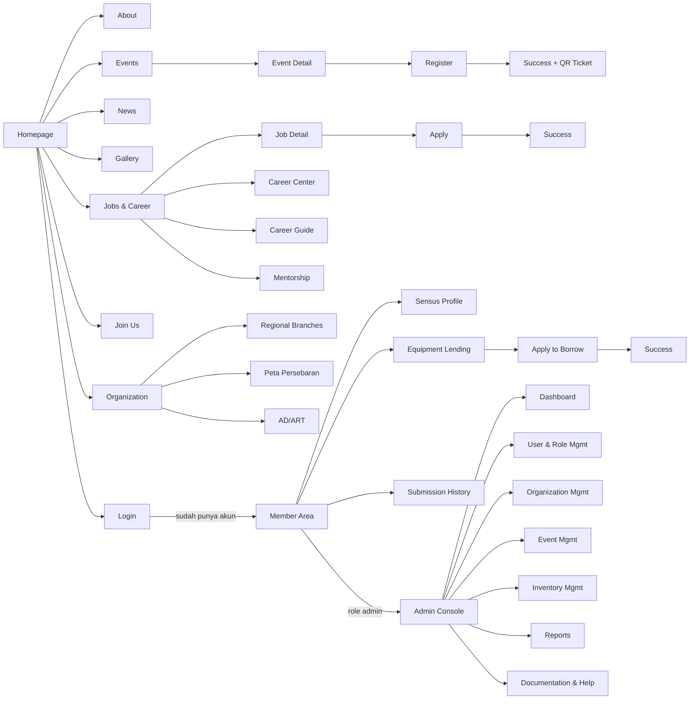

# Information Architecture — PPIT Nanjing

> Bagian dari [PPIT Nanjing MOC](./README.md). Disusun dari inventarisasi **95 file `code.html`** di kedua folder prototipe, yang setelah dedup iterasi desain (`_refined`, `_master_edition`, `_final_refinement`, `_navigation_updated`, `_animated` = revisi visual dari layar yang sama, bukan layar baru) menghasilkan **~63 layar fungsional unik**.

## Peta Navigasi Utama

## A. Public Website

| Layar (kanonik) | Rute usulan | Modul/Flow | Iterasi desain di prototipe |
|---|---|---|---|
| Homepage | `/` | [Homepage & Login](./Homepage%20&%20Login.md) | homepage, +5 varian (refined_1/2, final_refinement, animated, navigation_updated, logged_in_workflow_connected) |
| Login | `/login` | idem | login, refined_inputs, with_google |
| About Us | `/about` | [Organization & Regional Branches](./Organization%20&%20Regional%20Branches.md) | about_ppit_nanjing, master_edition |
| Organization Structure | `/organization` | idem | organization_structure, refined |
| AD/ART | `/organization/ad-art` | idem | ad_art_ppit_nanjing |
| Review AD/ART Guidelines | `/organization/ad-art/review` | idem | review_ad_art_guidelines |
| Regional Branches | `/organization/branches` | idem | regional_branches_ppi_tiongkok |
| Peta Persebaran | `/organization/map` | idem | peta_persebaran_ppit_nanjing |
| Events (listing) | `/events` | [Event Flow](./Event%20Flow.md) | events, master_edition, animated, refined |
| Event Detail | `/events/[slug]` | idem | event_details_ppit_nanjing |
| Event Registration | `/events/[slug]/register` | idem | event_registration_ppit_nanjing |
| Event Registration Success | `/events/register/success` | idem | (batch 2) event_registration_success |
| Event Reg. Success + QR Ticket | `/events/register/success/ticket` | idem | (batch 2) event_registration_success_qr_ticket |
| Event Submission Detail | `/profile/submissions/[id]` | idem | (batch 2) event_submission_detail |
| News (listing) | `/news` | [Content Pages](./Content%20Pages.md) | news_ppit_nanjing, master_edition |
| Gallery | `/gallery` | idem | gallery_ppit_nanjing, master_edition |
| Gallery Archive & Filters | `/gallery/archive` | idem | gallery_archive_filters |
| Jobs (listing) | `/jobs` | [Career Flow](./Career%20Flow.md) | jobs_ppit_nanjing, opportunities_refined, opportunities_expanded |
| Job Detail | `/jobs/[slug]` | idem | job_details_ppit_nanjing |
| Job Application Success | `/jobs/apply/success` | idem | job_application_success (+ _final, batch 2) |
| Career Center | `/career` | idem | career_center, comprehensive_career_center |
| Career Guide | `/career/guide/[slug]` | idem | career_guide_ppit_nanjing |
| Join Mentorship Program | `/career/mentorship/apply` | idem | join_mentorship_program |
| Join Us | `/join-us` | [Join Us Flow](./Join%20Us%20Flow.md) | join_us_ppit_nanjing |
| Join Us — Closed State | `/join-us` (state: tertutup) | idem | join_us_closed_state |
| Equipment Lending (katalog) | `/inventory` | [Equipment Lending Flow](./Equipment%20Lending%20Flow.md) | inventory_equipment_lending, inventory_management |
| Apply to Borrow Equipment | `/inventory/[id]/borrow` | idem | apply_to_borrow_equipment |
| Borrow Request Success | `/inventory/borrow/success` | idem | (batch 2) borrow_request_success |
| Sensus Profile | `/profile/sensus` | [Sensus Profile Flow](./Sensus%20Profile%20Flow.md) | completion, master_edition, interactive, refined_inputs, completion_refined, navigation_updated |
| Edit Profile | `/profile/edit` | idem | edit_profile_refined_inputs |
| Submission History | `/profile/submissions` | idem | (batch 2) submission_history |
| Terms & Privacy | `/terms`, `/privacy` | [Content Pages](./Content%20Pages.md) | terms_privacy_ppit_nanjing |

**34 layar publik unik.**

## B. Admin Console (`/admin/*`, protected + RLS by role)

| Layar (kanonik) | Rute usulan | Modul | Iterasi desain |
|---|---|---|---|
| Admin Dashboard | `/admin` | [Admin Dashboard](./Admin%20Dashboard.md) | master_dashboard, connected_overview, overview, navigation_updated |
| User Management | `/admin/users` | [User & Role Management](./User%20&%20Role%20Management.md) | user_management_admin_console |
| Add New User | `/admin/users/new` | idem | add_new_user_admin_console |
| Guide: User Management | `/admin/docs/guides/user-management` | idem | guide_user_management |
| Guide: User Roles & Permissions | `/admin/docs/guides/roles-permissions` | idem | guide_user_role_permissions, guide_updated_user_roles_permissions |
| Organization Management | `/admin/organization` | [Organization Management](./Organization%20Management.md) | organization_management_admin_console |
| Add New Department | `/admin/organization/departments/new` | idem | add_new_department |
| Edit Department Details | `/admin/organization/departments/[id]` | idem | edit_department_details, edit_department_refined_design |
| Manage Dept. Members & Roles | `/admin/organization/departments/[id]/members` | idem | manage_department_members_roles |
| Reorder Hierarchy | `/admin/organization/hierarchy` | idem | reorder_hierarchy_admin_console |
| Organizational Change Log | `/admin/organization/audit-log` | idem | organizational_change_log |
| Guide: Managing Regional Directories | `/admin/docs/guides/regional-directories` | idem | guide_managing_regional_directories |
| Event Management | `/admin/events` | [Event Management](./Event%20Management.md) | event_management_admin_console |
| Create New Event | `/admin/events/new` | idem | create_new_event |
| Edit Event Details | `/admin/events/[id]` | idem | edit_event_details |
| Manage Registrations | `/admin/events/[id]/registrations` | idem | manage_registrations |
| Event Attendance Report | `/admin/events/[id]/attendance-report` | idem | event_attendance_report |
| Guide: Event Management | `/admin/docs/guides/event-management` | idem | guide_event_management |
| Borrow Requests | `/admin/inventory/borrow-requests` | [Inventory Management](./Inventory%20Management.md) | borrow_requests_admin_console |
| Inventory Audit Report | `/admin/inventory/audit-report` | idem | inventory_audit_report |
| Guide: Inventory Control | `/admin/docs/guides/inventory-control` | idem | guide_inventory_control |
| Sensus Summary Report | `/admin/reports/sensus-summary` | [Reports & Analytics](./Reports%20&%20Analytics.md) | sensus_summary_report |
| New/Refined Report Generator | `/admin/reports/new` | idem | new_report_generator, refined_report_generator |
| Export Student Data | `/admin/reports/export-students` | idem | export_student_data |
| New Entry Selection (picker) | *(modal, bukan rute halaman)* | idem | new_entry_selection_admin_console |
| Documentation Hub | `/admin/docs` | [Documentation & Help Center](./Documentation%20&%20Help%20Center.md) | documentation_hub_admin_console |
| Help & Documentation | `/admin/docs/help` | idem | help_documentation_admin_console |
| Full Changelog (System) | `/admin/docs/changelog` | idem | full_changelog_admin_console |
| Guide: Notification Templates | `/admin/docs/guides/notification-templates` | idem | guide_configuring_notification_templates |

**29 layar admin unik.**

## Total: 63 layar fungsional, 95 file prototipe (termasuk iterasi desain)

## Prinsip Navigasi

- **Publik vs Member vs Admin** dipisah tegas lewat middleware Next.js + RLS Supabase (lihat [Tech Stack](./Tech%20Stack.md)) — bukan sekadar sembunyi-tampil di UI.
- **State bersyarat di layar yang sama** (bukan rute terpisah): Homepage berubah tampilan saat logged-in (`ppit_nanjing_homepage_logged_in_workflow_connected`), Join Us berubah saat periode pendaftaran ditutup (`join_us_closed_state`, dikontrol oleh `RECRUITMENT_PERIOD.is_open` — lihat [Data Dictionary](./Data%20Dictionary.md)).
- **Success/confirmation state** selalu jadi langkah eksplisit setelah form submit (Event Registration, Job Application, Borrow Request) — bukan sekadar toast — supaya user punya bukti visual & CTA lanjutan (lihat [Components](./Components.md) § Empty/Success State).
- **Admin console berbasis modul + dokumentasi terpasang** — setiap modul (User, Organization, Event, Inventory) punya halaman *Guide* sendiri di dalam produk (bukan wiki eksternal), cocok untuk pengurus baru yang bergantian tiap periode kepengurusan (turnover tinggi khas organisasi mahasiswa).

## Terkait

- [Entity Relationship Diagram](./Entity%20Relationship%20Diagram.md)
- [Design System Overview](./Design%20System%20Overview.md)
