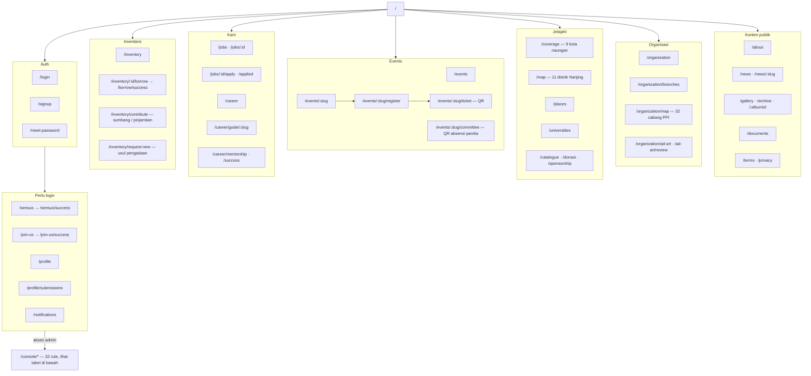

# Information Architecture — PPIT Nanjing

> Bagian dari [PPIT Nanjing MOC](./README.md). **Sumber kebenaran = `src/app/**/page.tsx`.** Audit terakhir: **2026-09-09** — **53 rute publik + 32 rute `/console`**. Rute dinamis (`[slug]`, `[id]`) dihitung satu.

Tidak ada prefix locale di URL (i18n lewat cookie/sesi, lihat [AGENTS.md](../AGENTS.md) § Internationalization). Pemisahan Publik / Member / Console ditegakkan di server (`src/proxy.ts` untuk maintenance mode; `requireModuleAccess()` per modul console), bukan sembunyi-tampil di UI.

## Peta navigasi

## A. Rute publik (53)

| Grup | Rute |
|---|---|
| **Beranda & legal** | `/` · `/terms` · `/privacy` · `/maintenance` · `/documents` |
| **Auth** | `/login` · `/signup` · `/reset-password` |
| **Profil (login)** | `/profile` · `/profile/submissions` · `/notifications` |
| **Sensus (login)** | `/sensus` · `/sensus/success` |
| **Join Us (login)** | `/join-us` · `/join-us/success` |
| **Organisasi** | `/organization` · `/organization/branches` · `/organization/map` · `/organization/ad-art` · `/organization/ad-art/review` |
| **Jelajahi** | `/coverage` · `/map` · `/places` · `/universities` · `/catalogue` · `/catalogue/donasi` · `/catalogue/sponsorship` |
| **Berita & galeri** | `/news` · `/news/:slug` · `/gallery` · `/gallery/archive` · `/gallery/:albumId` |
| **Events** | `/events` · `/events/:slug` · `/events/:slug/register` · `/events/:slug/ticket` · `/events/:slug/committee` |
| **Karir** | `/jobs` · `/jobs/:id` · `/jobs/:id/apply` · `/jobs/:id/applied` · `/career` · `/career/guide/:slug` · `/career/mentorship` · `/career/mentorship/success` |
| **Inventaris** | `/inventory` · `/inventory/:id/borrow` · `/inventory/borrow/success` · `/inventory/contribute` · `/inventory/request-new` |
| **Lain** | `/search` · `/l` (redirect short-link) |

## B. Rute `/console` (32)

`/console` hanya cek "punya akses admin apa pun"; tiap modul menegakkan aksesnya sendiri (`requireModuleAccess()`). Console **sengaja tetap Bahasa Indonesia** — pembacanya semua pengurus.

| Modul | Rute |
|---|---|
| **Dashboard** | `/console` |
| **Users & Role** | `/console/users` |
| **Organisasi** | `/console/organization` · `/console/organization/audit-log` |
| **Events** | `/console/events` · `/console/events/:id` · `/console/events/:id/scan` (kamera QR) |
| **Work Ledger** | `/console/work-ledger` — kepanitiaan lintas-acara, peringatan ≥3 kepanitiaan |
| **Inventaris** | `/console/inventory` · `/console/inventory/audit-log` |
| **Konten** | `/console/content` · `/console/content/news/new` · `/console/content/news/:id` · `/console/content/gallery/new` · `/console/content/gallery/:albumId` |
| **Katalog kota** | `/console/katalog` — places, universities, merchandise, sponsors, donation channels |
| **Keanggotaan** | `/console/membership` · `/console/membership/:id` · `/console/membership/form` (editor field) · `/console/membership/responses` |
| **Laporan** | `/console/reports` — generator + ekspor CSV |
| **Notifikasi** | `/console/notifications` — template |
| **Feedback** | `/console/feedback` — inbox widget |
| **Dokumentasi** | `/console/documents` · `/console/docs` · `/console/docs/new` · `/console/docs/:slug` · `/console/docs/changelog` |
| **Short link** | `/console/links` · `/console/links/new` · `/console/links/:id` |

## Prinsip navigasi

- **Publik / Member / Console dipisah di server**, bukan hanya di UI. Maintenance mode lewat `src/proxy.ts`.
- **State bersyarat di rute yang sama**, bukan rute terpisah: `/join-us` menampilkan "Pendaftaran Ditutup" saat `recruitment_periods.is_open` = false; halaman event punya wajah pra-acara vs pasca-acara (status `completed` atau `start_at` lewat); halaman tiket menampilkan panduan bayar vs QR tergantung `payment_status`.
- **Langkah `/success` eksplisit** setelah tiap submit (sensus, join-us, event register, borrow, job apply, mentorship) — bukti visual + CTA lanjutan, bukan sekadar toast.
- **Tiga peta berbeda cakupan**, saling ditautkan agar tidak tertukar: `/map` (11 distrik Kota Nanjing) · `/coverage` (9 kota naungan PPIT Nanjing) · `/organization/map` (32 cabang PPI se-Tiongkok).
- **Console modular + dokumentasi terpasang** (`/console/docs`) — cocok untuk pengurus yang bergantian tiap periode.

## Terkait

- [Entity Relationship Diagram](./Entity%20Relationship%20Diagram.md)
- [Event Flow](./Event%20Flow.md) · [Career Flow](./Career%20Flow.md) · [Equipment Lending Flow](./Equipment%20Lending%20Flow.md)
- [Design System Overview](./Design%20System%20Overview.md)
