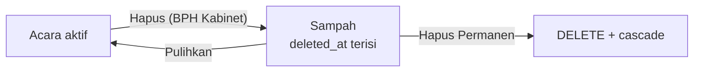

# Sampah Kegiatan

"Hapus" di konsol Kegiatan tidak menghapus baris acara. Acara dipindah ke **Sampah** (soft delete), dan baru hilang dari database lewat **Hapus Permanen**. Tujuannya: salah klik atau salah pilih acara tidak menghapus pendaftar, panitia, dan evaluasi secara permanen.

## Alur

| Aksi | Siapa | Tempat | Efek |
|---|---|---|---|
| Hapus (pindah ke Sampah) | adminScope `full` (kapabilitas `event.delete`) | `/console/events` (tiap baris) dan tombol "Hapus Kegiatan" di halaman acara | `events.deleted_at = now()`, `deleted_by = user`. Status acara **tidak** diubah. Audit `event.trashed`. |
| Pulihkan | adminScope `full` | Bagian **Sampah** di `/console/events` | `deleted_at`/`deleted_by` dikosongkan; acara kembali dengan status semula (kalau `published`, langsung tampil lagi). Audit `event.restored`. |
| Hapus Permanen | adminScope `full`, hanya untuk acara yang sudah di Sampah | Bagian **Sampah** | Perilaku hapus lama: album galeri dilepas tautannya, lalu `DELETE` (pendaftaran, panitia, divisi, evaluasi, dll. ikut terhapus lewat cascade; sertifikat dan artikel berita tersisa dengan `event_id = NULL`). Audit `event.deleted` dicatat sebelum DELETE. |

Tidak ada pembersihan otomatis: acara tetap di Sampah sampai BPH Kabinet menghapusnya permanen.

## Apa yang "hilang" saat acara di Sampah

- **Akses panitia & konsol**: `getEventAccess()` (`src/lib/event-access.ts`) mengembalikan akses ditolak (`trashed: true`) untuk siapa pun, termasuk BPH Kabinet. Jadi semua server action, route ekspor, dan halaman konsol acara yang memakai `requireEventCapability` / `requireEventConsoleAccess` / `getEventAccess` otomatis menolak. `requireEventConsoleAccess` mengarahkan ke `/console/events`.
- **Publik**: daftar `/events`, beranda, pencarian global, sitemap, katalog sponsor, dan semua halaman per-slug (`/events/:slug`, `/register`, `/ticket`, `/scan`, `/committee`, `/evaluasi`, `/evaluasi-panitia`) → 404. Aksi publik (daftar, evaluasi, evaluasi panitia, daftar relawan) menolak acara di Sampah.
- **Daftar lain**: daftar kegiatan konsol (admin & "Acara Kepanitiaan Saya"), dasbor konsol, dropdown acara di Inventaris & Work Ledger, beban kepanitiaan, rekap pembayaran lintas-acara, laporan kehadiran, dan riwayat pendaftaran di profil anggota.
- **Publikasi terjadwal** (`publishDueEvents`) melewati acara di Sampah.

Tidak disaring (sengaja): sertifikat yang sudah terbit (tetap milik penerimanya, sama seperti setelah hapus permanen) dan reservasi aset Inventaris (tetap aktif, sama seperti perilaku hapus lama — batalkan manual di Inventaris bila perlu).

## Untuk developer

- Kolom: `events.deleted_at` (timestamp), `events.deleted_by` (uuid → users, `ON DELETE SET NULL`). Migrasi `drizzle/0048_event_trash.sql`.
- **Setiap query baru yang menampilkan atau menerima acara harus menyaring `isNull(events.deletedAt)`**, kecuali sudah lewat `getEventAccess`. Cari `deletedAt` untuk contoh.
- Server actions: `deleteEvent` (pindah ke Sampah), `restoreEvent`, `deleteEventPermanently` di `src/app/actions/admin-events.ts`. Dua yang terakhir memeriksa `adminScope === "full"` langsung karena `getEventAccess` menolak acara di Sampah.
- UI: bagian Sampah di `src/app/console/events/page.tsx`; dialog hapus di `src/components/console/delete-event-button.tsx`.
- Help Center: artikel `kegiatan` di `src/db/seed-help-articles.ts`.
